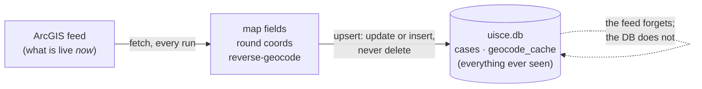

# 1. A notice is a row
*~8 min read · commits of 24–26 Jun 2026, PRs #1–#4 · 24–30 June 2026*

*Where we are:* the very beginning. Nothing exists yet but a question and a public map. By the
end of this chapter there is a small database of water notices on my laptop, and one design
decision that everything later depends on.

## The question that opened this stretch

For a stretch of 2026 the water in Leixlip, the town in north Kildare where I live, kept going
off. Not for long, usually — an evening, a morning — but often enough that I started to wonder
whether this was normal. Uisce Éireann, the national water utility, publishes every disruption
notice on a public map on its website. Each notice is a pin: a title like *Burst Main – Kildare*,
a location, a paragraph of text, and a start date. So the question I actually wanted answered was
simple to state:

> Are other areas having as many outages as I am?

You cannot answer that from the map. The map shows what is happening *now*. It does not show what
happened last month, it does not add anything up, and it has no notion of "as many as". To
compare Leixlip with anywhere else I would need every notice, kept, over time — and then some way
of counting that was fair to towns of different sizes. The second half of that turned out to be
most of the project. This chapter is about the first half: getting the notices, and keeping them.

## What changed

### 24–25 June: fetch the feed

The map on the utility's website is drawn from an **ArcGIS feature service** — a hosted map layer
that any program can query for its underlying records. The first useful commit (25 June) did
exactly that: ask the service for every record (`where 1=1`, every field), and save the answer.

> **Concept: an ArcGIS feed.** ArcGIS is the commercial mapping platform most public bodies use to
> publish maps. Behind a public map is usually a *feature service*: a web address that, instead of
> returning a picture, returns the records the picture was drawn from, as structured JSON. Each
> record is a *feature* — a geometry (here, a single point) plus a bag of named attributes
> (title, description, dates, flags). You query it the way you would a database table, with a
> `where` clause and a list of fields, and it hands back pages of records. Nothing about this is
> secret or scraped: it is the same endpoint the public map itself calls. What it does *not* do,
> as we will see, is remember anything.

Two small technicalities that matter later. First, the geometry comes back in **Web Mercator**
(the coordinate system web maps draw in, measured in metres from the equator and Greenwich
meridian), so each point is converted to ordinary latitude and longitude. Second, every date
arrives as milliseconds since 1970 — an integer like `1754774213000` — and is converted to a
readable timestamp. Neither is interesting; both are the kind of thing that costs an afternoon the
first time.

### 26 June: give every pin an address

A pin has coordinates but no address. The feed does carry a `location` string and a `county`, but
the location is whatever a person typed (`Leixlip`, `Forest Park, Leixlip`, `Mount Carmel,
Newbridge`) and the county is occasionally blank or misspelt. So the second commit sent every
coordinate to a **reverse-geocoding** service (LocationIQ, a commercial front on OpenStreetMap
data) and kept the answer.

> **Concept: reverse geocoding, and why there is a cache.** *Geocoding* turns an address into
> coordinates; *reverse geocoding* turns coordinates into an address — road, town, county,
> postcode. It is a paid, rate-limited web call: one coordinate per request, a polite pause
> between requests. Two things keep it affordable. The coordinate is first **rounded to four
> decimal places** — about 11 metres — so two pins dropped on the same street corner share one
> lookup (an earlier commit had five places, roughly a metre; four was judged enough). And every
> answer is written to a **cache**, a table keyed by the rounded coordinate, so a coordinate is
> only ever looked up once, however many times the pipeline runs. The cache is what makes
> re-running free.

I should be honest about how much the rounding saves *within* one run: almost nothing. On the
database as it stands (18 Aug 2026), 10,610 cases sit at 10,550 distinct rounded coordinates.
Pins are almost never dropped in the same 11-metre square twice. The cache's real job is *across*
runs — the next fetch geocodes only the handful of new coordinates, not ten thousand — and that is
what chapter 2 leans on.

### 29 June: a database

Up to here the output was JSON files. PR #2 (29 June) put it in **SQLite** — a database that lives
in a single file, needs no server, and can be queried with ordinary SQL — with two tables: `cases`,
one row per feed record, and `geocode_cache`, one row per rounded coordinate. The word "case" is
the utility's own: it is what the `reference_num` field calls each notice.

> **Concept: notice, pin, case.** A *notice* is what the utility publishes. It appears on the map
> as one or more *pins* — points with coordinates. The feed returns one record per pin, and the
> database stores one row per record and calls it a *case*. For now, treat the three words as
> the same thing at different stages: notice (published) → pin (on the map) → case (in the table).
> Chapter 9 is where "one notice, many pins" stops being a nuance and starts costing money.

### 30 June: two clean-ups and one decision

PR #3 fixed what a first look at the data turned up. A few records had no title and no text at
all — nothing a reader could use — and are now skipped and reported. One county was spelt
`Dnegal`. Debug output that had been printing every case went away.

PR #4 is the one that matters. Until then, every run **dropped both tables and recreated them**
from the fresh download. That is the natural way to write a first version: the feed is the truth,
so start clean each time. It is also exactly wrong for this feed, and the reason is the most
important fact in this whole story.

> **Concept: the feed has no memory.** The feed returns *current* notices. When a notice is
> withdrawn or expires it simply stops being returned, and nothing in the service tells you it
> was ever there. Worse, the layer *declares* fields called `LASTUPDATE` and `CREATEDATE` — I only
> checked them a month later (21 July) and found both are NULL on **all 8,155** records; the
> service supports queries only, no change tracking, no historic queries. So the feed is a complete
> list of *what is live* and carries no time dimension at all. If you want to know what happened
> last month, the only copy of last month is the one you kept yourself. A pipeline that drops the
> table and starts clean throws that copy away every time it runs.

So PR #4 changed the load to an **upsert**: for each downloaded record, update the existing row if
one exists, insert it if not — and never delete. From that commit on, `uisce.db` stops being a
snapshot of the map and becomes an *archive* of it, and every case the feed later forgets is
still there. It was a change of a few dozen lines. Everything from chapter 5 onward — availability figures,
month-by-month history, the drill-down into towns — is computed over cases the feed no longer
serves, and exists only because of it.

### Worked example: one Leixlip notice, end to end

Here is a real case, chosen because it is close to home. On the evening of 9 August 2026 the
utility published a notice with reference `KLD00118059`. As it arrived from the feed, the record
was a point in Web Mercator plus attributes; after mapping, this is its row in `cases` (measured
18 Aug 2026, text trimmed):

| Column | Value |
|---|---|
| `reference_num` | `KLD00118059` |
| `title` | Investigation Works - Kildare |
| `work_type` | Unplanned |
| `status` | Closed |
| `start_date` | 2026-08-09 21:16:53 UTC |
| `end_date` | 2026-08-10 21:16:57 UTC |
| `location` | Leixlip |
| `county` | Kildare |
| `full_lat`, `full_lon` | 53.3626770739666, −6.50595919066385 |
| `rounded_lat`, `rounded_lon` | 53.3627, −6.506 |
| `water_outage` | 1 |
| `description` | "**Update 1:00pm 10/08/2026** Works are now complete and supply should have returned to all affected areas. We are investigating reports of supply disruptions affecting Forest Park, Leixlip and surrounding areas in Co. Kildare. Crews are working to restore supply as soon as possible. Please take note of the following reference number … KLD00118059." |

Three things to notice, because each becomes a chapter.

*The dates.* `start_date` is 21:16 on the 9th, `end_date` is 21:16 on the 10th — exactly 24 hours
and 4 seconds later. That is not when the water came back. The text says works were complete by
1 pm on the 10th. `end_date` here reads like a system default — a day on from the start, to the
second — and the real end is buried in the prose. Getting it out is chapter 3, and what it is *not* is chapter 6.

*The coordinates.* Rounding 53.3626770739666 to 53.3627 moves the pin about 3 metres. The rounded
pair is the key into `geocode_cache`, whose row for it reads: road *Forest Park*, town *Leixlip*,
county *County Kildare*, postcode *W23 A6YH*, region *The Municipal District of Celbridge –
Leixlip*. That "County Kildare" versus the feed's "Kildare" is a tiny thing that PR #6 will
normalise in chapter 2.

*The columns that aren't there.* Nothing in this row says how many people were affected, or how
long "Forest Park and surrounding areas" is across. The feed gives a point; it does not give a
footprint. Chapters 5 and 8 are about manufacturing one, honestly, from the Census.

## Where it left the site

There was no site. There was a script that, run by hand, produced a `uisce.db` holding every
notice seen so far, with an address on each pin — and, after PR #4, kept it. The database at
that point held around five thousand cases (PR #6 gives "~10 of 5,000+" for a count made the
same day). What it could not yet do was run itself, which is the next, short, chapter.

## Notes

- Commits: `c171eb6` (fetch, map fields, Web Mercator → lat/lon, 25 Jun); `5ac63dc` (geocode,
  4-dp rounding, LocationIQ, 26 Jun). PRs #1 (tidy-up and CI lint, 26 Jun), #2 (SQLite, 29 Jun),
  #3 (skip unusable cases, `Dnegal`, 30 Jun), #4 (upsert, 30 Jun).
- `notes/how-it-works.md` "The shape of it"; `notes/data-quality.md` "The feed carries no
  modification timestamp" (probed 21 Jul 2026 — the 0-of-8,155 figure is from then, not June).
- Figures: 10,610 cases / 10,550 distinct rounded coordinates, and the `KLD00118059` row, measured
  18 Aug 2026 against `out/uisce.db`; the four-decimal rounding ≈ 11 m of latitude.
