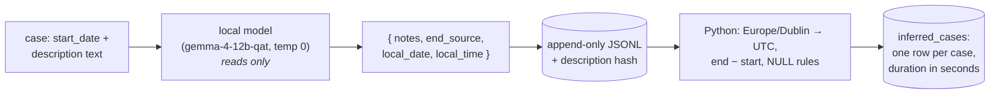

# 3. Ask a local model what the notice actually says
*~10 min read · PRs #8–#13 · 2–9 July 2026 (with a benchmarking detour on 15 July)*

*Where we are:* an archive of every water notice, growing by itself each week (chapters 1–2).
Every case has a start date. What none of them reliably has is an end — and without an end there
is no duration, and without durations there is no "as many outages as me". This chapter gets the
end out of the only place it lives: the prose.

## The question that opened this stretch

Look again at the Leixlip notice from chapter 1. Its `end_date` column says 21:16:57 on 10
August — twenty-four hours and four seconds after it started. Its text says *"Works are now
complete"* as of 1 pm. The column is a system default; the truth is in the paragraph.

How general is that? I checked on 7 July, once there was something to check against: for the
2,500 cases where the text carried an unambiguous "works are now complete" update, the feed's
`end_date` agreed with the text **within even an hour only 6.6% of the time**. Many were off by
hundreds of hours; a suspicious number landed exactly on −30 days, −29 days, +24 h or 0 h — the
fingerprints of a system stamping defaults, not a person recording an event. So `end_date` was
out. If I wanted to know when the water came back, something had to *read* eight thousand
paragraphs and write down what they said.

## What changed

### PR #8, 2 July: a model on my laptop reads the notices

The reader is a **large language model** — but a small one, by the standards of the phrase, running
entirely on my own machine: `gemma-4-12b-qat`, served by an app called LM Studio, no cloud, no
per-call fee, no notice text leaving the house. A script feeds it each case's start date and
description with a fixed instruction, and it answers with a small block of JSON.

> **Concept: LLM extraction is structured reading, not writing.** People meet these models as
> chatbots that generate text. Used this way they are closer to a very fast, very literal clerk
> filling in a form. The instruction (the *prompt*) says: here is a notice; find the sentence that
> says when the works end; tell me which *kind* of sentence it was — a confirmed completion, a
> scheduled estimate, nothing at all — and copy out the date and time; write your reasoning first
> so the answer has to follow from it. The output is a fixed set of named fields, checked by
> ordinary code, and stored beside the case. Nothing is "generated" in the creative sense; the
> model is paid to notice and transcribe. That framing — *how little can I ask it to do?* — is the
> lesson of the very next PR.

### PR #9, 3 July: do less work in the model

The first prompt asked for too much. It explained Irish daylight-saving rules, gave the 2026
changeover dates, and told the model to convert every local time to UTC and return a full
timestamp with a `+00:00` suffix. Asked to do arithmetic, the model did what such models do
when pushed off reading and onto computing: it sometimes made things up, and sometimes never
stopped — the commit message says *"hallucinations and infinite loops"*, and I remember watching
one answer scroll for a very long time.

The fix was to take the arithmetic away. The rewritten prompt opens: *"You do NOT do any date
maths or timezone conversion. Python does that afterwards."* The model now reports four things:

- `notes` — its reasoning, written *first*, so the fields below have to agree with it;
- `end_source` — one of `completion_update`, `scheduled_end_with_time`,
  `scheduled_end_date_only`, `not_found`, or the new `lifted_immediate` (a boil-water notice
  lifted "with immediate effect", with no separate time given);
- `local_date` — the date, rewritten as `YYYY-MM-DD` from the Irish day/month/year in the text;
- `local_time` — the time as a 24-hour clock string in Irish local time, *not converted*.

Temperature (the model's randomness dial) went to zero. Everything with a right answer —
which timezone applied, what the elapsed seconds were, whether the end came before the start —
moved into plain code, where it can be tested. This is the single most useful thing I learned
about using these models for data work: **let the model read; keep the sums.**

### PR #10, 6 July: only re-read what changed

Notices change. An update block is prepended when works finish; a case flips from Open to
Closed. The first version of the script skipped any case it had already seen, which meant a
notice inferred while still open — "estimated completion 6 pm" — was never revisited after the
"works are now complete" update arrived. It would carry the estimate forever.

The fix is a **hash**: a short fingerprint computed from the description text. Each inference
record now stores the hash of the text it was read from, along with the model name and a prompt
version number. A case is re-read only if it is new *or* its current text hashes differently
from the last one read. The 5,911 records already produced were backfilled with hashes,
verified against the exact release database the original run had used.

> **Concept: hash-based incremental work.** A hash function turns any text into a fixed-length
> string of characters — 64 hex characters, here — such that the same text always gives the same
> string and any change to the text, however small, gives a different one. Storing "the hash of
> what I read last time" beside each answer is a cheap way to ask "has this changed?" without
> storing, or re-reading, the whole text. Every case that has not changed is skipped for free;
> every one that has is re-read. The archive keeps every reading it ever made, so the history of
> a case's text is preserved too.

That last point became a design rule. The inference results live in an **append-only JSONL file**
— one JSON record per line, new readings added at the end, nothing ever edited — committed to the
repository (PR #11). The database table `inferred_cases`, one row per case, is *built from* the
file, not the other way round. The file is the truth; the table is a convenience.

### PR #11, 7 July: from a date and a time to a duration

With a start (from the feed) and a local date and time (from the model), code can compute the
elapsed seconds — using Python's `zoneinfo` for the Europe/Dublin clock, so an outage that
straddles a daylight-saving change gets its true elapsed time rather than a wall-clock
difference. Three cases get **NULL** (no value) rather than a number:

- `end_source` is `not_found` or `lifted_immediate` — there is nothing to measure;
- the case has no `start_date`;
- the computed end comes *before* the start.

That last rule tripped on about 19 cases, noted at the time as "likely reflecting known
start/end unreliability in the feed rather than a bug". It was not a bug. It was also not 19 — by
20 July it was 532, and it becomes chapter 6's problem.

Where the model found a date but no time of day, the end is taken as 23:59:59 on that date. It
was originally meant for the `scheduled_end_date_only` class; it turned out to be needed for some
completion updates too, which say "works completed on the 14th" and no more.

### PR #12, 8 July: pin the start, and let two files disagree loudly

Two things surfaced while chasing duplicate case IDs in the JSONL. First, the feed's `start_date`
**moves**: the same case, seen in two different downloads, showed the identical time of day with
the date shifted forward by whole days — the same stamping artefact already seen in `end_date`.
So the duration is now computed from the start seen by the *first* inference of a case, not
whatever the feed says today. (Whether to take the first-seen or the earliest-ever value turns
out to matter, and is settled — the wrong way is tempting — in chapter 6.)

Second, the JSONL and the database are **independently evolving artefacts**. The JSONL is
produced on whichever machine ran the model (a faster laptop, that week); the database is
whatever release the CI last built. Build the table from a JSONL that mentions cases the local
database has never seen and it fails. The decision was not to build reconciliation tooling but
to fail *clearly* — name the missing case range, say how to refresh — and write the coupling
down in a note. Chapter 4 makes that habit official.

### PR #13, 9 July: the weekly build carries the table

Three lines in the workflow: after fetching cases, build `inferred_cases` from the committed
JSONL and publish it inside the release database. It works because of chapter 1's upsert: the
CI database only ever grows, so every case the JSONL names is always present. First run: 6,561
rows, no errors.

### 15 July: could it be faster? (No.)

A one-day detour, kept because the answer saves anyone else the day. Each notice took about
1.9 s: 0.6 s for the model to take in the ~1,000-token prompt and description, and the rest
producing the ~75-token answer at ~57 tokens per second. Sending the long instruction every time
was *not* the cost; the writing was, and the `notes` field is most of the writing — and also
what makes the answer reliable, so it stayed. Running requests in parallel bought ~1.1× (the
model is limited by memory bandwidth, not by how many questions are queued). A smaller, faster
model — `qwen3.5-9b`, ~40% quicker — agreed with gemma on only 61% of cases, and on inspection
gemma was right almost every time: qwen refused to read completion times out of `**Update 9am
15/07/2026**` header blocks (150 cases), converted 1:36 pm to 16:36, and mislabelled boil
notices *issued* "with immediate effect" as lifted. Slower and right won.

### Worked example: KLD00118059 again

The Leixlip notice from chapter 1, as it stands in the database (measured 18 Aug 2026; the
reading is by prompt version 3, which chapter 9 explains, but the fields are the ones PR #9
defined):

| Field | Value |
|---|---|
| `end_notes` | "A completion phrase appears in the update block at the top: 'Works are now complete' at 1:00pm on 10/08/2026. Completion update takes priority, so end_source is completion_update. No repeating window." |
| `end_source` | `completion_update` |
| `end_local_date` | 2026-08-10 |
| `end_local_time` | 13:00 |
| `end_input_start_date` | 2026-08-09 21:16:53 UTC |

Now the sums, done by code, not the model. 10 August is inside Irish Summer Time, so 13:00 local
is **12:00:00 UTC**. From the start, 21:16:53 UTC on the 9th, to midnight is 2 h 43 m 07 s =
9,787 s; from midnight to 12:00 is 43,200 s; total **52,987 s**, which is what the row says: 14
hours 43 minutes from the notice being published to the works being reported complete. The
feed's own `end_date` would have said 24 hours and 4 seconds.

## Where it left the site

Still no site — but for the first time, a duration for (nearly) every case, derived from what
the notice actually said, rebuilt weekly, with a fingerprint on every reading so changed notices
are re-read and unchanged ones are not. Two things were missing, and each got its own chapter.
Nobody had yet measured how *often* the model was right — that is chapter 5's job, and the
answer starts at a sobering 71.9%. And the column was called `end_duration_seconds`, which is not
what it measures: it is the span from *publication* to reported end, and the difference is
chapter 6.

## Notes

- PR #8 (2 Jul): first inference script, gemma-4-12b-qat via LM Studio, prompt v1 (asked the
  model for a UTC timestamp, with DST rules in the prompt). PR #9 (3 Jul): prompt v2 — model
  reports `notes`, `end_source`, `local_date`, `local_time` only; temperature 0; `lifted_immediate`
  added. PR #10 (6 Jul): `description_hash`, `model`, `prompt_version` per record; 5,911 backfilled;
  `inferred_cases` as a projection of the JSONL. PR #11 (7 Jul): `end_duration_seconds` via
  `zoneinfo`; NULL rules; ~19 negative spans; JSONL committed. PR #12 (8 Jul): start pinned to the
  first inference's value; clear failure on a stale DB; `notes/pipeline-dependencies.md`. PR #13
  (9 Jul): table built on CI; 6,561 rows.
- `notes/model-and-runtime-benchmarks.md` (15 Jul 2026): 0.6 s prefill / ~1.9 s per call at ~57
  tok/s; parallel ≈ 1.1×; qwen3.5-9b 1.15 s/call, 61% agreement, disqualifying error modes.
- `notes/data-quality.md`: `end_date` agrees with completion updates within 1 h in 6.6% of 2,500
  cases (probed 7 Jul); the "~19" negative spans became 532 by 20 Jul.
- `notes/end-time-eval.md` "Decision: `lifted_immediate` is excluded" (18 Jul): 42 pins → 15 lift
  events out of 7,553 cases (0.56%).
- KLD00118059 `inferred_cases` row measured 18 Aug 2026; 52,987 s arithmetic shown above.
