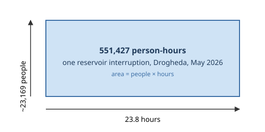

# 5a. A website, and a number that is fair to Cork
*~7 min read · PR #16 · 18 July 2026*

*Where we are:* an archive of every notice with a machine-read end time on nearly all of them
(chapters 1–4). Nothing has been shown to anyone. This chapter builds the first web page — and
discovers that the obvious way to score a county is unfair to big ones, which is how the Census
gets involved.

## The question that opened this stretch

The original question was comparative: *is Leixlip worse than elsewhere?* A comparison needs a
number per place per month, and the obvious number, borrowed from the "status pages" that
software companies publish, is **uptime**: what fraction of the month had no active outage?

I computed it per county. Cork's uptime for May 2026 was **2%**.

That is not because Cork was without water for 29 days. It is because Cork is large — 584,156
people, hundreds of separate supply schemes — and at almost any moment *somewhere* in Cork has a
notice open. Binary uptime at county level punishes size and, worse, punishes diligent
reporting. A county is not one pipe. So before there could be a page there had to be a measure
that a burst main serving two thousand people did not turn into "Cork is down".

## What changed

### Person-hours: how many people, for how long

The measure the electricity industry uses for exactly this problem is to weight each
interruption by *how many customers it hit* — the family of indices called SAIDI. I borrowed the
idea. Each notice pin is assumed to affect the people who live near it; an event's cost is
*people affected × hours affected*; a county-month's availability is one minus the share of all
possible person-hours that were lost.

> **Concept: person-hours.** If 1,000 people are without water for 3 hours, that is 3,000
> person-hours of disruption — the same as 3,000 people for one hour, or 300 people for ten. It
> is a rectangle: *people* up one side, *hours* along the other, and the area is the number.
> Person-hours add up across events in a way that "number of outages" cannot: a two-minute
> outage and a two-day one stop counting as one each. The unit is the whole reason the site can
> say a big town's short outage and a village's long one are, or are not, the same amount of
> harm.

*Who* is affected is the hard part, and it is the whole of chapter 8. For now, the first version's
rule, still in force: every Census 2022 **Small Area** whose centre lies within **500 metres** of
the pin is assumed to be affected, and their populations are added up. If none is that close —
a rural pin — the single nearest Small Area within 8 km is used. Small Areas are the Census's
smallest published unit, roughly 50–200 households each, 18,919 of them summing to exactly the
state's 5,149,139 people; their populations and centre points were fetched once from the CSO
and committed as a 19,000-row CSV, so the site never needs the internet to build.

> **Concept: population-weighted availability.** For a county and a month:
>
> availability = 100 × (1 − person-hours lost ÷ person-hours possible)
>
> where *person-hours possible* is the county's population × the hours in the month (or the part
> of it observed so far), and *person-hours lost* is the sum, over every outage event, of its
> affected population × its hours inside the month. Under this measure Cork's May 2026 is
> about **99.2%**. Everyone in Cork counts in the denominator whether or not they were near a
> notice; only people near a notice count in the numerator; and a notice's cost is proportional
> to how many people it reached and how long it lasted. That is the sense in which it is fair to
> Cork — and, later, hard on Leixlip.

### Not every notice is an outage

The second decision the page forced was that **not every notice should count**. Before the
split, *Investigation Works* alone contributed about 8% of all accrued hours (4,090 h in
May–June against 27,128 h from burst mains) — and an investigation is a crew looking for a
leak, not a household without water. So each case is put in one of four classes, from its
`work_category` (chapter 4) and impact flags, in a fixed order:

1. **quality** — boil-water, do-not-drink, discolouration notices;
2. **degraded** — conservation orders, low-pressure notices;
3. **outage** — burst mains, reservoir / treatment-plant / pump-station interruptions, power
   outages, and unplanned repairs (a mains repair that is not marked Planned normally means the
   supply is off);
4. **works** — everything else: investigations, leak detection, hydrant works, installations,
   anything Planned.

Only **outage** accrues person-hours against availability. The rule was stated in the PR as
"an F should mean people lost water, not that a county ran many investigations". The other
classes still appear — coloured on the day bars, counted, listed — they just do not move the
number. This is also the first place the flags in the feed were tried and found wanting: the
`water_outage` flag, which sounds like the thing you'd want, is set on 97% of cases and filters
nothing.

### One event, not thirteen pins

Chapter 1 promised that "one notice, many pins" would start to matter. Here is the first place.
A single reservoir interruption in Drogheda was published as thirteen pins in 22 minutes, all
sharing one reference number. Counted per pin, that is thirteen events, each with its own
footprint, most of them overlapping. So cases are grouped into **events** by `reference_num`
before any accounting; an event's time intervals are unioned (two pins covering the same hour
count that hour once); and its affected population is the union of its pins' Small Areas —
each Small Area counted once, however many pins reach it — capped at the county population.
Chapter 9 revisits all of this when it turns out that some "events" are eighteen nightly
windows in a trench coat.

### Grades, and the copy on the page

Availability is a percentage with a lot of nines in it, and readers do not feel the difference
between 99.6 and 99.2. So each county-month gets a letter: **A ≥ 99.9%, B ≥ 99.75%, C ≥ 99.45%,
D ≥ 99.0%, F below** — driven by outages only. Where the cut points came from is a chapter 12
story; the short version is that they were fitted to this dataset's own spread, deliberately
*not* borrowed from regulators. Ofwat's target for English water companies is about five
minutes of lost supply per property per year — 99.999% — but that counts *measured* minutes at
the tap, for interruptions of three hours or more; this project counts the entire published
notice for everyone within an assumed 500 m, including "customers may experience disruption"
notices and short ones. The two differ by construction, by two or three orders of magnitude, and
the gap says nothing about Irish water. So the page says, deliberately, that it measures
*announced disruptions and time-to-fix* — not availability in the regulator's sense.

The rest of the page: a month view per county with a coloured bar per day; a median time-to-fix
over resolved events; and, quietly, a **tripwire** — `first_seen`/`last_seen` stamps on every
case, so that if the utility ever starts deleting notices from the feed (a live check on 16
July confirmed it had not, since collection began around 20 April), the archive will notice.

### Worked example: one interruption, one county-month

The largest single event of May 2026 was a reservoir interruption across Drogheda: 23.8 hours,
whose unioned footprint of Small Areas held about 23,169 people (measured then; Drogheda's whole
population is 44,135, so roughly half the town). Its cost:

23,169 people × 23.8 h = **551,427 person-hours**.

Louth's population is 139,703 and May has 744 hours, so Louth's *possible* person-hours for the
month were 139,703 × 744 = **103,939,032**. If that had been the only outage in Louth all
month:

availability = 100 × (1 − 551,427 ÷ 103,939,032) = **99.469%** — a **C**.

One day, half of one town, and the county's month is a C on its own. That is the measure working
as intended: it is sensitive to real disruption in proportion to how many people it reached.
It is also the first hint of chapter 8's problem — because the same 551,427 person-hours, set
against *Drogheda's* 44,135 people instead of Louth's 139,703, would be a 98.3%, an F, and that
is the number a Drogheda resident would actually want.

## Where it left the site

A page, at last: every county, every month since April, a letter grade, a day-by-day bar, a
time-to-fix. Under it, three ideas that never went away — person-hours, population weighting
from Census Small Areas within 500 m, and outages-only — and one that did (that a county is the
right unit; chapter 8). And beneath *that*, a machine-read end time on every event that no
human had yet checked. PR #16 also shipped the first check. That is chapter 5b.

## Notes

- PR #16 (18 Jul 2026): `uisce-site`, `site.py` + `site.html`; per-county month view; SAIDI-style
  availability from Census 2022 Small Areas within 500 m (`data/sa_pop.csv` via
  `uisce-fetch-sa-pop`); A–F on outages only; boil-notice issue→lift pairing; median time-to-fix;
  `first_seen`/`last_seen`; 86 tests.
- `notes/statuspage-methodology.md` "Why not plain uptime?" (Cork May 2026: 2% vs ~99.2%),
  "Severity classes" (investigation 4,090 h vs burst mains 27,128 h; `water_outage` on 97%),
  "Events, intervals, and edge cases", "Grades" (thresholds); `notes/water-sla-benchmarks.md`
  (Ofwat 5 min/property/yr ≈ 99.999%; why not borrowed).
- `notes/data-quality.md` "Multi-pin events": LOU00112686, 13 pins in 22 minutes.
- Drogheda 23.8 h / 551,427 person-hours: `notes/statuspage-methodology.md` "Recurring windows
  cover hours, not days" (as May's largest event). Louth 139,703 and Drogheda 44,135: `site.py`
  `COUNTY_POP` and `data/sa_towns.csv` (verified 18 Aug 2026). The 99.469% / 98.3% arithmetic is
  mine.
- `site.py`: `region_month` (person-seconds and availability), `grade`, `classify`,
  `SmallAreaIndex.affected`.
