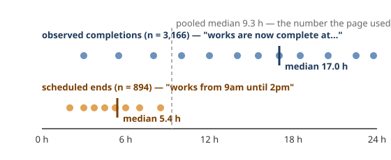

# 6. Say what you actually measured
*~9 min read · PRs #18–#20 · 20 July 2026*

*Where we are:* a public page with a grade per county-month and a "median time to fix" (chapter
5a), resting on end times now measured at ≥97.5% accurate (chapter 5b). This chapter is one
day's work — three PRs on 20 July — and it changes no algorithm of consequence. It changes what
the numbers are *called*, which numbers are allowed to be averaged together, and it stops the
site fabricating a hundred thousand person-hours in Kildare.

## The question that opened this stretch

Chapter 5b ended with a recommendation nobody had acted on: rename the metric for what it is.
The page said *median time to fix*. The column said `end_duration_seconds`. Both claimed to
measure how long the water was off. Neither could: the feed never records when supply was lost
(chapter 1's `start_date` is a publication timestamp — 97.6% of values carry non-zero seconds,
the fingerprint of a machine stamp, not a person writing "9 am"), so the start of every span is
the moment someone pressed publish. And the end, it turned out, was two different things wearing
one label.

## What changed

### PR #18: two honesty problems, one rename

**Naming.** What is measured is the span from *notice publication* to *the end the notice
reports*. So: `end_duration_seconds` became `notice_to_end_seconds`; `median_fix_h` became
`median_completion_h`; the JSONL file that chapter 3 made the source of truth was renamed from
`inferred_duration` to `inferred_end_times`, because it holds end *signals* and the arithmetic
happens later. The page now leads with the caveat and says plainly that every figure is a
**floor** on the true length.

> **Concept: a floor is not an estimate.** An *estimate* of an outage's length tries to land on
> the true value and may miss either way. A *floor* is a number the true value is known to be at
> least as large as. Because the clock here starts at publication — after the water went off,
> for an unplanned event — the measured span can only be shorter than the real one, never longer.
> That is a useful thing to know and an honest thing to say, and it changes how a reader should
> use the median: not "outages last 17 hours" but "from the moment the public was told, it was at
> least 17 hours until the public was told it was fixed".

**Observed versus scheduled.** The second problem was worse, because it was numerical. The
model reads two kinds of end (chapter 3): a **completion update** — *"works are now complete at
10:39am"* — which is an observation, and a **scheduled end** — *"works from 9am until 2pm"* —
which is a plan. The page's median pooled both under "time to fix … resolved", claiming
observation for all of it. Measured on 20 July, within the outage class that feeds the metric:

| end signal | n | median |
|---|---|---|
| `completion_update` (observed) | 3,166 | **17.0 h** |
| `scheduled_end_with_time` (a plan) | 894 | **5.4 h** |
| pooled — as previously published | 4,060 | 9.3 h |

Scheduled ends were 22% of the pool and dragged the headline from 17.0 h to 9.3 h.

> **Concept: why pooling two populations lies.** A median is the middle value of a sorted list.
> Mix a large set of long, spread-out values with a smaller set of short, tightly bunched ones
> and the middle slides down toward the short set — not to a weighted average of the two
> medians, but to wherever the combined sorted list happens to have its midpoint. The two sets
> here are not even measuring the same thing: scheduled ends skew to short planned windows
> announced in advance; completion updates skew to unplanned bursts fixed when they were fixed.
> They answer different questions. Averaging them produces a number that answers neither.

The resolution is not to throw the plans away. A published plan is still the best available
interval for a scheduled job, so scheduled ends **still accrue** person-hours against availability
— dropping them would under-count exposure. They are simply excluded from the published median
and reported beside it as "+N scheduled-only". One constant, `OBSERVED_END_SOURCES`, is the
switch. The split holds every month, at event level: observed medians of 7.1 / 12.6 / 15.8 /
10.2 h for April to July against scheduled 4.8 / 5.3 / 4.4 / 4.3 h.

**Two findings written down and not acted on.** First, 90.3% of completion updates *retain* the
originally scheduled window in their text, which gives a schedule-overrun signal that never
touches `start_date` at all: a cheap regex probe found **69.5% of works finish late**, median
+2.7 h, and only 8.8% within 15 minutes of their own estimate. Unvalidated, parked. Second, CI
never ran the model, so 183 cases were un-inferred — 98% of them open, accruing to "now" not
because anything was ongoing but because nobody had read them yet. That inflates the newest
month specifically; options were written up and deliberately not chosen that day.

### PR #19: the site was fabricating time in Kildare

Chapter 3 recorded "~19 cases" where the model's end came *before* the notice's start and the
duration was set to NULL. A proper count on 20 July made it **532** — 6.6% of the corpus — and,
spot-checked across the range, the model was right every time: the text really does state an
end before the publication timestamp.

Most of them are mundane. Median −2.7 h, 78% within six hours before publication, and the
descriptions are same-day: a notice published *after* the works window it announces has closed,
or a first publication that already carries the completion update. For these the true
notice-to-end value is zero or less — the event was over when it was published — and NULL is
the honest store. The tail is different: 18 cases more than a day negative, where `start_date`
was clearly re-stamped later. One case states works for 8 May and carries a `start_date` of 8
*June*, exactly a month on; the JSONL's own history shows ten cases whose `start_date` changed
between two readings with **the date part moving while the machine time-of-day survived** —
`12:43:19` kept, date +40 days. The feed edits publication dates in place.

None of that would matter to the page — the spans were already NULL — except for what the site
did with an *open* case that had no duration: it let it accrue from publication until "now",
toward the 14-day cap. Twenty-eight of the 532 were open. Twelve of those were outage-class. So
twelve notices whose own text said the works were finished were charging population-weighted
downtime for up to fourteen days each. In July alone that was roughly **101,000 fabricated
person-hours in Kildare** and 66,000 in Donegal.

The fix (`ended_by_publication`) routes any case whose extracted end precedes its start — and
`lifted_immediate` cases — to a token one-second footprint: the day still colours, the event
still counts, nothing accrues. Genuinely no-signal open cases accrue exactly as before. Verified
against the real database at a fixed timestamp: only the four affected counties moved.

Two rescue routes were tried before accepting the exclusion, and both closed. *Use the earliest
`start_date` the JSONL ever saw* — already built (chapter 3's pin), but it can only witness a
re-stamp when the description changed in the same window, and only 1 of the 532 has two starts
on record; and taking the *minimum* recorded start instead of the first-seen would be a worse
rule, because backward re-stamps (−30 days) would then inflate durations with a bogus early
start. That is the answer chapter 3 promised. *Use the description's stated works window as the
start* — parses for 90% of them, but for scheduled cases gives plan-minus-plan (median 4.0 h,
zero observational content) and for the rest a hybrid that must never join the published median.

Also in PR #19: `create_db` had declared `work_category` twice since the schema was pinned, which
SQLite rejects — so the pipeline could not create a database from nothing. CI never noticed
because it downloads the released database first (chapter 2); the tests never noticed because
the fixture hand-built the schema instead of calling the function it claimed to test. A
from-scratch run per the README crashed after geocoding. Fixed, and a test now runs the real
`create_db` against a fresh path. The lesson generalised into a repo rule later: the schema is
declared exactly once, and a test fails if a second statement of it reappears.

### PR #20: the page publishes itself

Twenty-one lines: after each database build, run `uisce-site` and deploy `out/site/` to GitHub
Pages. The site build needs only the freshly built database and the committed Small Area CSV, so
no new inputs; site steps run only after a successful pipeline and release, so the published
page always reflects a completed build. One manual step in the repository settings, and from
that day the page at `baz8080.github.io/uisce` has been rebuilt on the same schedule as the
archive.

### Worked example: a notice that ended before it began

Case 237573 (measured 20 Jul 2026). Its description says works run *"9am until midday on 03
July"*. Its `start_date` — the publication timestamp — is **17:04 on 3 July**. The model
correctly reads the end as 12:00 local; the span from publication to end is 12:00 − 17:04 =
**−5 h 04 m**. The works were over five hours before the public was told about them.

Under chapter 3's rule the duration is NULL — there is no positive span to record, and pretending
it was zero would put a false zero into the median. Under PR #19's rule the case also stops
accruing on the site: had it been open, it would previously have charged its footprint's
population for every hour from 17:04 until the build ran. Multiply that by twelve outage-class
cases in the same state, some near the 14-day cap, and you have Kildare's 101,000.

And the median, made concrete with a toy list. Observed spans (hours): 10, 15, **17**, 20, 30 —
median 17. Scheduled: 4, **5**, 6 — median 5. Pooled and sorted: 4, 5, 6, 10, 15, 17, 20, 30 —
the middle two are 10 and 15, median **12.5**. The pooled number is not 17, is not 5, and is not
their weighted average (14); it is wherever the mixture's midpoint fell. That is the mechanism by
which 3,166 observations at 17.0 h and 894 plans at 5.4 h were being published as 9.3 h.

## Where it left the site

Same page, honest labels. "Median notice → completion" over observed completions only, with the
scheduled count beside it; every figure declared a floor; the schema stamped at version 1 and
refusing anything older with rebuild instructions rather than guessing; and the site deploying
itself. Two loose ends were left on the table with numbers attached — 69.5% of works finish
late, and 183 un-inferred cases inflating the newest month — and one bigger one nobody had
looked at yet: the feed publishes only *current* status, so nobody could say in which month a
case had actually closed. That is chapter 7.

## Notes

- PR #18 (20 Jul 2026): renames (`notice_to_end_seconds`, `median_completion_h`,
  `inferred_end_times.jsonl`); observed 17.0 h (n=3,166) vs scheduled 5.4 h (n=894) vs pooled
  9.3 h; `OBSERVED_END_SOURCES`; schema pinned at v1, stamp-in-place for the unstamped published
  DB; overrun probe 69.5% late / +2.7 h / 8.8% within 15 min; 183 un-inferred (98% open); 114
  tests.
- PR #19 (20 Jul): 532 negative spans (314 scheduled, 218 completion; median −2.7 h, 78% within
  −6 h; 18 more than a day negative); 28 open, 12 outage-class; ~101k person-hours Kildare, ~66k
  Donegal, July; `ended_by_publication`; both rescue routes closed (1 of 532 has two starts;
  minimum-start rejected; stated-window plan-minus-plan median 4.0 h); `create_db` duplicate
  column; 118 tests.
- PR #20 (20 Jul): Pages deploy after each build.
- `notes/statuspage-methodology.md` "The published time metric is notice → observed completion";
  `notes/data-quality.md` "Sharpened 2026-07-19" (97.6% non-zero seconds), "Resolved 2026-07-20",
  "Measured 2026-07-20: ends preceding publication are 532 cases" (case 237573; re-stamp
  evidence; re-measured 646 on 15 Aug — chapter 12).
- The toy median list is illustrative, not data.
