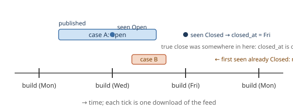

# 7. Record the moment a case closes
*~9 min read · PRs #21–#22 · 21 July 2026*

*Where we are:* the page publishes itself, says what it measures, and grades every county-month
since April (chapters 5–6). But it cannot say a simple thing about a past month — how many
cases closed in it — because the feed only ever says what is true *now*. This chapter makes the
archive remember one more thing, discovers that the previous three weeks can be partly rescued
from an accident of chapter 2, and doubles the build cadence for a reason that turns out to be
the wrong one.

## The question that opened this stretch

A reader clicking on June saw "49 open now" — a right-now count with no month dimension, sitting
on a historic month as if it were a fact about June. It was the only open/closed figure the site
had, because it was the only one the database *could* have. The feed publishes each case's
current `status`; the upsert (chapter 1) overwrites it in place; so the moment a case went from
Open to Closed was observable exactly once — at the build that first saw the change — and was
being thrown away every time. On a phone, meanwhile, the whole stats column had fallen off the
right edge of the card. PR #21 fixed both, and the second fix needed the schema to change for the
first time since it was pinned.

## What changed

### `closed_at`: the archive learns to notice a transition

The new column is stamped in the upsert at the moment the previous status was Open and the
incoming one is not. Nothing cleverer than that is possible, and three properties follow that
every later reader has to hold in mind:

- **It is observation time, not event time.** The stamp is when a *build* first saw the case
  non-Open. Its resolution is the gap between builds.
- **NULL is ambiguous.** A NULL means *either* still open *or* closed before the column existed.
  It has to be read alongside `status`.
- **It is a floor.** A case that opens and closes inside a single gap between builds is never
  observed Open at all, so there is no transition to record. Measured that day: **12%** of
  newly-appearing cases, under the Monday/Wednesday/Friday cadence.

> **Concept: observation time versus event time.** The database can only record what it saw,
> when it saw it. A case that closed at 3 pm on Tuesday and was first seen closed at Wednesday's
> 6 pm build gets `closed_at` = Wednesday 6 pm. That is not wrong — it is exactly what happened
> from the archive's point of view — but it is a different quantity from "when the case closed",
> and it inherits the shape of the build schedule. You can see this directly in the data: on the
> current database, `closed_at` values pile up on build days — 304 on 6 July, 363 on 15 July,
> 365 on 17 July, 399 on 20 July — because that is when the looking happened, not when the
> closing did.

Two small implementation points that are worth a sentence because they are the kind of thing
that silently produces wrong data. The comparison uses `IS NOT 'Open'` rather than `!= 'Open'`,
because a handful of rows carry a NULL status and, in SQL, `NULL != 'Open'` is not true — it is
NULL, and the transition would never fire. And the reopen branch is checked *first*, so a case
that goes Closed → Open again has its stale stamp cleared rather than kept.

### Schema v2, and the shape a migration is allowed to have

Adding a column sounds trivial. It is not, here, because of chapter 2: the published database is
downloaded and updated in place each build, and `CREATE TABLE IF NOT EXISTS` will not add a
column to a table that already exists. The alternative — rebuild the database from the feed —
is not free either. It costs every case the feed no longer serves and roughly 8,000 geocode
lookups. Chapter 6 had just pinned the schema at version 1 and made the code *refuse* anything
older. Now something older had to be carried forward.

> **Concept: an additive-only migration ladder.** A *migration* is a recorded step from one
> version of a database's structure to the next. The ladder here is deliberately narrow: each
> step may only *add nullable columns* — a shape written down as `{version: {column:
> declaration}}` and nothing else. SQLite applies such a change without rewriting a single row
> (0.7 ms on the live 20 MB database, integrity check clean, no rows touched), and a nullable
> column with no data is, by construction, harmless to every reader that does not know about it.
> Anything that would *change* existing data is not a migration in this codebase; it is a
> rebuild, and a rebuild costs the archive. A database missing any of the original columns is
> still refused rather than repaired. The rule has held: schema versions 2 and 3 are both single
> nullable columns.

The rollout needed no ceremony: the version check already runs on every build, so the next
scheduled build migrated the release database in place and published version 2.

### Recovering the past from an accident

`closed_at` can only be stamped going forward. Every case that had closed before 21 July would
carry NULL forever — unless the transition could be found somewhere else. Two places were
checked.

**The feed itself.** The ArcGIS layer *declares* fields called `LASTUPDATE` and `CREATEDATE`, and
its metadata names edit-tracking fields. This is the probe chapter 1 quoted: both are NULL on
all 8,155 records; the edit fields are not exposed; the service supports queries only, no change
tracking, no historic queries. The feed is a complete archive of *cases* and a pure snapshot of
*status*. Written down, in the words of the PR, "because those fields will keep looking
promising to the next reader".

**The release snapshots.** Chapter 2 mentioned, in passing, that each build published the whole
database as a dated release, and that this was history nobody had set out to build. Here it
pays. Ten releases existed, from 30 June to 20 July. Line up consecutive snapshots, compare each
case's `status` column, and every Open → Closed flip between two snapshots is a transition — the
same measurement the live path makes, just made late.

| | |
|---|---|
| Closed cases on 21 July | 7,613 |
| Recovered by replaying the snapshots | **1,816 (24%)** |
| Closed before the first snapshot (30 June) | 5,797 — gone |

The replay never overwrites a live stamp (the live one is at least as precise), skips cases
that are currently open, and can be run twice with no effect — verified against the real
database, which stamped zero more on the second pass. It runs as an optional step *after* the
pipeline in the same build, so the schema is already migrated and that build's own stamps are
in; the replay covers snapshot-to-snapshot, the upsert covers the last snapshot to now, and
nothing falls between. It stays in the workflow, switched off, as the recovery path if the
database is ever restored from an older release. Three weeks of accidental snapshots bought a
quarter of the closures the archive had missed.

### PR #22: build daily — for a reason that was half right

If the gap between builds is the resolution of `closed_at`, and 12% of cases fall through a
gap of up to three days, then shrink the gap. Eight lines: the cron went from Monday, Wednesday,
Friday to every day. About 20 MB per release, so roughly 7 GB a year of release assets instead
of 3; a public repository can carry it, and each extra snapshot is more replay resolution.

The PR was careful about one consequence: the 12% was measured under the old cadence, so *the
undercount is not comparable across the change*. Months from August would carry a smaller
undercount than July, and a month-on-month drop in closure counts could be an artefact of the
cadence rather than a real change. That went into the notes beside the original figure.

What the PR could not know is what a re-measurement ten days later found. Under daily builds,
of 933 newly-seen cases, only **18 (1.9%)** were never observed open — the cadence had done its
work. But comparing each observed closure against the model's reading of when the works actually
finished (n = 484): median **+75.7 hours**, and 97% more than a day late. The utility stamps a
case Closed roughly three days after the works are done. Past a daily cadence, the build gap is
a small quantisation on top of a much larger administrative lag that no build frequency can
close — and the 18 turned out not to be fast events narrowly missed but notices posted at or
after completion: chapter 6's negative-span family, which no cadence can catch open. The floor
had an owner, and it was not the schedule. (The move to *two* builds a day on 31 July was made
for a different reason — publication latency — and is chapter 9's.)

### Worked example: KLD00118059's five days

The Leixlip notice from chapters 1 and 3, read through `closed_at` (measured 18 Aug 2026):

| Moment | What happened |
|---|---|
| Sun 9 Aug, 21:16 UTC | Published (`start_date`) — after that evening's build had run |
| Mon 10 Aug, 12:01 | First observed, already Open (`first_seen`) |
| Mon 10 Aug, 13:00 local | Text says *"Works are now complete"* — the event is over |
| Mon 10 Aug 18:45 → Wed 12 Aug 18:45 | Five more builds see it, still `Open` |
| Thu 13 Aug, 12:02 | First observed not Open → **`closed_at` = 2026-08-13 12:02** |

From the works actually finishing to the archive seeing the case closed: about **72 hours** —
almost exactly the 75.7-hour median. The site knows the water was back at 1 pm on the Monday,
because chapter 3 read it out of the text. What `closed_at` adds is different and smaller: a
month to file the closure under, and the honest admission that the utility's own bookkeeping ran
three days behind the crew.

## Where it left the site

Nothing visible yet — the PR says "no site changes depend on `closed_at`; the first complete
month will be July". Under the surface: a database that records transitions from now on, a
migration ladder that can add a column in under a millisecond without risking the archive, a
quarter of the pre-existing closures recovered from snapshots nobody had planned as history, and
a daily cadence. Four days later the site started using `closed_at` for the one thing it is good
for — giving a past month with zero open cases something true to say — and that is where
chapter 8 begins.

## Notes

- PR #21 (21 Jul 2026): 640 px breakpoint for the county row; open-case figures hidden on
  historic months; `cases.closed_at` (schema v2); `MIGRATIONS = {version: {column: decl}}`,
  0.7 ms on the 20 MB DB; `IS NOT` vs `!=`; reopen branch first; ArcGIS `LASTUPDATE`/`CREATEDATE`
  0 of 8,155; replay of 10 snapshots (30 Jun – 20 Jul): 1,816 of 7,613 (24%), 5,797
  unrecoverable; 142 tests.
- PR #22 (21 Jul): cron `MON,WED,FRI` → daily; ~7 GB/yr vs ~3 GB; 12% not comparable across the
  change.
- `notes/data-quality.md` "`closed_at` is a floor" and "Re-measured 2026-07-31": 18 of 933
  (1.9%) never seen open under daily builds; observed close vs inferred completion median
  +75.7 h, p25 +57.2 h, p90 +85.2 h, 97% > 24 h (n = 484). README `closed_at` paragraphs.
- Measured 18 Aug 2026 against `out/uisce.db`: 4,303 of 10,130 non-Open cases carry `closed_at`
  (the rest predate the first snapshot); `closed_at` by day: 6 Jul 304, 8 Jul 113, 10 Jul 209,
  15 Jul 363, 17 Jul 365, 20 Jul 399 (the Mon/Wed/Fri snapshot dates); KLD00118059 `first_seen`
  2026-08-10 12:01:46, `closed_at` 2026-08-13 12:02:06.
