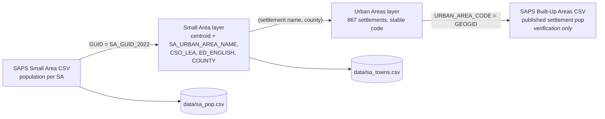
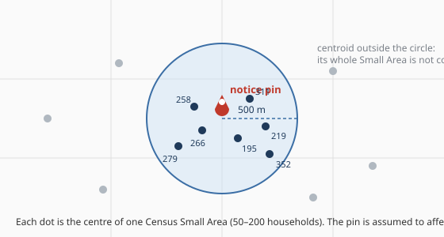

# 8a. How a pin gets a population
*~11 min read · PR #23, first half · 25 July 2026*

*Where we are:* the site grades every county-month (chapter 5a) and can now say which month a
case closed (chapter 7). But "Kildare 99.25%" is not an answer to *is Leixlip worse than
elsewhere?* — it is the average of Leixlip and Naas and everywhere between. To go below the
county, the site has to know two things about every pin it has never been told: **how many
people live near it**, and **what that place is called**. This chapter is the first of two on
how it finds out, and it is the part of the project that outgrew my understanding first. It
begins with the file formats, because the file formats are where the mistake was.

## The question that opened this stretch

The commit that started PR #23 says it plainly: *"Kildare 99.25%" hid the fact that Leixlip lost
a ninth of its person-time and Naas lost none.* The population-weighting from chapter 5a already
gave every pin a footprint of people; what it lacked was a *name* for the place those people
lived. And the obvious source of names — the feed's own `location` field — turned out to be
unusable. Nationally it has **3,866 distinct values**. It splits one town three ways (`Newbridge`,
`Newbridge,`, `Mount Carmel, Newbridge`); it lists housing estates and street names as if they
were places (Marlton Park, Wolstan Haven Road); and it carries no population, so nothing can be
weighted by it. The geocode cache from chapter 1 was worse: 94% of its rows name only a
`city_district`, which is mostly Electoral Divisions and bridges. So the names, like the
populations, had to come from the Census.

## What changed

### The unit everything is built from: the Small Area

> **Concept: the Census 2022 Small Area.** The Central Statistics Office divides the state into
> **18,919 Small Areas** — the smallest unit for which it publishes population — each roughly
> 50 to 200 households, drawn so that a rural one is a few townlands and an urban one is a few
> streets. Every person in the 2022 Census is counted in exactly one. Add up all 18,919 and you
> get **5,149,139** — the published state total, to the person. Each Small Area has a permanent
> identifier (a long hexadecimal *GUID*), a boundary, a **centroid** (a single point at its
> centre), and — this is the part that mattered — a set of *attributes* the CSO fills in itself:
> which county it is in, which Electoral Division, which Local Electoral Area, and, if it lies
> in a town, which town.

Chapter 5a used Small Areas already, for population. What this chapter adds is the discovery
that the same file answers the naming question too, and that the way I first tried to answer it
was wrong.

### The four Census files, and how they join

Nothing here needs a GIS package or a shapefile. It needs four downloads and three join keys,
and every one of them has a trap.

| File | What it gives | Key | Trap |
|---|---|---|---|
| **SAPS Small Area CSV** (~39 MB) | population per Small Area — column `T1_1AGETT` ("theme 1, all ages, both sexes") | `GUID` | ships with a UTF-8 byte-order mark; 18,920 rows for 18,919 areas |
| **Small Area ArcGIS layer** | each Small Area's centroid, *plus* the attributes `SA_URBAN_AREA_NAME`, `CSO_LEA`, `ED_ENGLISH`, `COUNTY_ENGLISH` | `SA_GUID_2022` (= the CSV's `GUID`, all 18,919 match) | the live service name is misspelt "Genralised"; you must ask for centroids explicitly, no polygons needed |
| **Urban Areas layer** | the 867 named settlements with a stable code and county | `URBAN_AREA_CODE` | the Small Area carries its settlement's *name*, not its code — this file supplies the key |
| **SAPS Built-Up Areas CSV** | published population per settlement — *verification only* | `GEOGID` = `URBAN_AREA_CODE` | encoded cp1252, not UTF-8 (a fada in "Dumha Thuama" kills a UTF-8 read at byte 8,073); and it has 868 rows because one is the `Ireland` total |

Two committed files fall out, refreshed only if the CSO redraws the map: `data/sa_pop.csv`
(GUID, longitude, latitude, population — 18,919 rows) and `data/sa_towns.csv` (GUID → named
area and county). The site never touches the network to build.

### From a pin to people: the 500 m centroid rule

Here is what happens to a coordinate. Every Small Area centroid is dropped into a grid of
0.01° bins (about 1.1 km of latitude), so that finding "everything near this point" means
looking in a handful of neighbouring bins rather than at all 18,919 rows. Then:

1. Take every Small Area whose **centroid** lies within **500 m** of the pin (plain
   straight-line distance, with longitude scaled by the cosine of the latitude — the usual
   flat-earth shortcut, fine at this scale). Their populations, summed, are the pin's
   affected population.
2. If **no** centroid is that close — a pin on a rural road — take the **single nearest** Small
   Area within 8 km instead.
3. Cache the answer per rounded coordinate, since chapter 1 already rounds pins to 11 m.

> **Concept: centroid, not polygon.** A Small Area is a shape on a map. The rule does not ask
> "which shapes does the circle overlap?" — that needs the shapes, and the shapes are heavy and
> generalised. It asks "which shapes' *centre points* fall inside the circle?", and treats each
> such Small Area as wholly affected and every other as wholly not. It is an approximation, and
> a coarse one at the edge — a Small Area whose centre is 510 m away contributes nothing though
> half of it may be inside — but it is symmetric, it needs no geometry library, it runs on
> 10,000 pins in well under a second, and 500 m is itself an assumption about how far a burst
> reaches (chapter 12 measures how much rides on it). Doing it with the real polygons would be
> more precise about the wrong thing.

### From people to a place: an attribute, not a shape

That gives *how many*. For *where*, my first implementation did the obvious thing: download the
boundary polygons of the 867 Census settlements (37 MB), and for each Small Area centroid, ask
which settlement polygon it falls inside — sixty lines of even-odd ray casting, in pure Python,
binned by tenths of a degree, under a second for 18,919 points. It recovered 97.5% of the urban
population. Naas came out at 25,824 against a published 26,180; Newbridge exact; **Leixlip
exact at 16,733.** It looked fine. The check only warned for settlements over 5,000 recovering
less than 80%, and none tripped it.

Then, chasing a source for rural place names, I noticed that the Small Area layer already
carried `SA_URBAN_AREA_NAME` — the CSO's *own* statement of which settlement each Small Area
belongs to — on a query the pipeline was already making. Not just lighter: **exact**, where the
approximation was wrong in ways that had reached the page.

- **54 settlements had no row at all** — 15,893 people. Their boundary polygon happened to
  contain no Small Area centroid, so the ray-casting saw nothing inside them. Knockbridge (759
  people), Termonbarry (699), Kilmore Quay (447) simply did not exist in the drill-down; their
  cases fell into the rural bucket and the village never appeared.
- **187 of 789 settlements were more than 10% short on population.** Doneraile, Co. Cork, read
  **214 people against a published 857** — the polygon caught one of its three Small Areas and
  missed the other two. And availability divides by that population. So a burst main in
  Doneraile showed roughly **four times worse than reality**.

Summing Small Areas by attribute now reproduces **all 867 published settlement populations to
the person**, and the urban total, 3,630,501, exactly. The ray casting, both polygon downloads
and a separate LEA population file were deleted; the fetch dropped from 25 s to 4 s; and the
verification asserts *equality*, not a tolerance — the CSO does the assignment, so any drift
means the two files have stopped describing the same geography.

The join has two measured wrinkles. **Nineteen settlement names are shared by unrelated places**
— a Milltown in Kerry, another in Kildare, a third in Galway — so the join is on (name, county),
with the CSO's 34 local authorities mapped onto the 26 counties the site uses. And a settlement
can genuinely **straddle a county line** — Limerick's suburbs into Clare, Waterford's into
Kilkenny, Drogheda into Meath — leaving its far-side Small Areas with no (name, county) pair; those
fall through to the name alone, which happens to be unambiguous for every straddler on file.
Measured: 13,060 matched on the pair, 125 straddlers, none ambiguous, none unresolved.

> **Concept: what "wrong in ways that reached the page" means.** The polygon method was not a
> bug in the usual sense — it ran, it agreed with the truth for the big towns, its own check
> passed. It was a *systematic under-count* concentrated in small places, where one centroid
> landing outside a generalised boundary is a large share of the total. And because the number
> it produced was a *denominator*, the error did not shrink the site's figures — it inflated
> them, silently, exactly where the fewest people would notice. The lesson generalised: prefer
> a source's own assignment over a re-derivation of it, and when a check passes, ask what the
> check is not looking at.

### Worked example: the Leixlip pin, and Leixlip

Take `KLD00118059` again — the Forest Park notice from chapters 1, 3 and 7 — at its rounded
coordinate 53.3627, −6.506. Running the index against it (measured 18 Aug 2026):

| Distance from pin | Small Area population |
|---|---|
| 56 m | 266 |
| 92 m | 195 |
| 174 m | 258 |
| 225 m | 311 |
| 229 m | 219 |
| 230 m | 279 |
| 249 m | 197 |
| 296 m | 241 |
| 376 m | 239 |
| 406 m | 358 |
| 407 m | 340 |
| 495 m | 352 |
| **12 Small Areas within 500 m** | **3,255 people** |

Every one of the twelve carries the attribute `SA_URBAN_AREA_NAME = Leixlip`. So the pin's
footprint is 3,255 people, all in Leixlip; and since chapter 3 gave this case a
notice-to-completion span of 52,987 s (14.72 h), it charged Leixlip 3,255 × 14.72 ≈ **47,900
person-hours**. Widen the circle to 1 km and it would catch 29 Small Areas and 8,440 people;
narrow it to 300 m and 8 Small Areas, 1,966. Affected population scales roughly with the
*square* of the radius, which is why chapter 12 has to take the 500 m assumption seriously.

And Leixlip itself: **56 Small Areas** carry the Leixlip attribute, and their populations sum to
**16,733** — the CSO's published Census 2022 figure for the town, exactly. That is the
denominator against which chapter 8b's "Leixlip, July 2026: 95.88%" is computed.

## Where it left the site

Two committed lookups — a population and a centroid for every Small Area, and a named area for
every Small Area — both derived from the CSO's own attributes, both verified to the person, no
polygons anywhere. Every pin now has an affected population *and* a place name, and the site
knows the population of every named place. What it did not yet have was a rule for turning that
into rows on a page: what to do when a city is one settlement, when a pin is in no settlement
at all, or when its 500 m circle straddles two. That is chapter 8b, and it ends at the Kildare
table.

## Notes

- PR #23 (25 Jul 2026), commits "Map Census Small Areas to the settlements they sit in" (the
  polygon version: 37 MB, ray casting, 12,837 of 18,919 SAs in a settlement, 3,539,104 people =
  97.5%; Naas 25,824 vs 26,180, Newbridge 24,366 exact, Leixlip 16,733 exact) and "Take the
  drill-down geography from CSO attributes" (54 settlements / 15,893 people missing; 187 of 789
  >10% short; Doneraile 214 vs 857; 867 exact; 3,630,501; 25 s → 4 s; 19 shared names; 13,060 /
  125 / 0 / 0).
- `notes/population-data-sources.md` (whole): file URLs, `T1_1AGETT`, `utf-8-sig` vs cp1252
  (byte 8,073), 868 rows, `returnCentroid=true`, "Genralised".
- `src/uisce/site.py` `SmallAreaIndex` (`BIN = 0.01`, `_near`, `affected`; `AFFECT_RADIUS_KM`
  0.5, `FALLBACK_KM` 8.0); `src/uisce/towns.py` `resolve_settlements`.
- Measured 18 Aug 2026: KLD00118059 footprint 12 SAs / 3,255 people (300 m: 8 / 1,966; 1 km:
  29 / 8,440); Leixlip 56 SAs / 16,733; Doneraile SAs 385 + 214 + 258 = 857; 3,255 × 14.72 h ≈
  47,900 person-hours is my arithmetic from the chapter 3 span.
- `cases.location` 3,866 distinct values; geocode cache 94% `city_district` only: PR #23.
