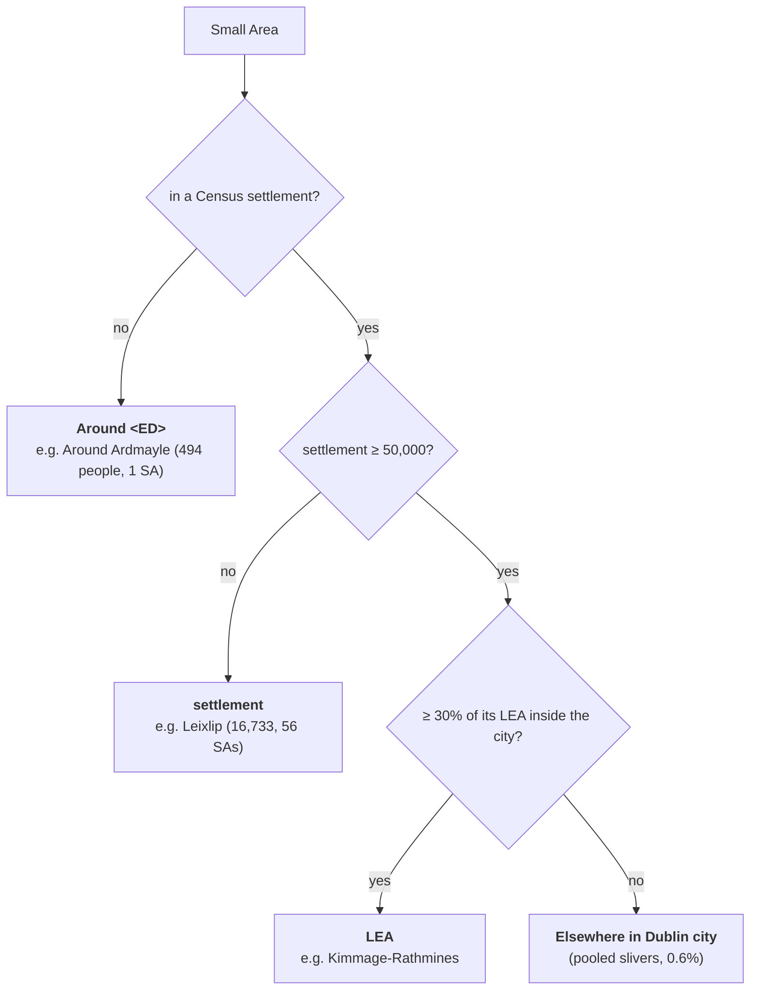

# 8b. Where you actually live
*~11 min read · PR #23, second half (with #24–#25 as footnotes) · 25–27 July 2026*

*Where we are:* every pin has an affected population and every Small Area carries the CSO's own
name for the place it belongs to (chapter 8a). What is left is the set of rules that turn
18,919 labelled Small Areas into rows a reader can find themselves in — and the moment the site
finally answered the question it was started to ask.

## The question that opened this stretch

Three problems stood between "every Small Area has a settlement name" and a useful page. The
Census counts a *city and its suburbs* as one settlement, so for Dublin the drill-down would do
nothing. About 40% of pins are in **no** settlement at all — the network's reservoirs and trunk
mains run *between* towns — and they would all land in one undifferentiated bucket. And a pin's
500 m circle can, in principle, straddle two places. Each needed a rule; the rules had to be
defensible; and the whole had to fit in a single page that works opened off a disk.

## What changed

### Three tiers, one rule

> **Concept: the three tiers.** Every Small Area is filed under exactly one *area*, of one of
> three kinds:
>
> 1. a **settlement** — the Census town it lies in (Leixlip, Naas, Doneraile);
> 2. a **Local Electoral Area**, when the settlement is one of the five "city and suburbs"
>    agglomerations over 50,000 (Kimmage-Rathmines, Cork City South East);
> 3. **"Around \<Electoral Division\>"**, when it lies in no settlement — the countryside of the
>    parish around the place the ED is named for (Around Ardmayle, Around Lackagh).
>
> The single rule that picks the layer is: **the finest official geography whose names arrive
> usable.** Row counts follow from that; they are not the reason for it.

*Cities.* `Dublin city and suburbs` is one settlement of **1,261,884** people, and it held 808
of Dublin's 973 cases — **83%** in one row. So any settlement over 50,000 (a population rule,
not a name match; the next largest, Drogheda, is 44,135) is split into the Local Electoral Areas
its Small Areas fall in. Dublin becomes **40 rows**, the busiest carrying eight disruptions.
LEAs are not contained by the settlement — they run out into the county — so a part is kept only
when 30% of its LEA lies inside; the leftovers pool into one "Elsewhere in Dublin city" row (0.6%
of the city; Waterford's 9.6% is Ferrybank, across the Kilkenny line). That threshold turned out
to do more than tidy: the four LEA labels that would have collided with an existing town row on
the same page — Swords, Macroom, Carrigaline, Cobh — were all slivers, structurally, since an LEA
carries a town's name precisely when it is named after a town *outside* the agglomeration.

*Why LEA and not the finer Electoral Division in cities?* This is where the one rule earns its
keep. City EDs arrive as `Bishopstown A` … `E`, `Arran Quay A` … `E` — **242 of the 1,492 EDs
touching urban Small Areas are letter-suffixed**. Using them means inventing a name-merging
heuristic, the same string-munging the project refused when it declined to key on
`cases.location`. Rural EDs: **0 of 2,552** suffixed. They arrive as `Ardmayle`, `Nodstown`,
`Ballymackey` — the names locals use. So the city stops at the LEA and the countryside goes to
the ED. (An earlier draft argued the reverse on row-count grounds — ~4 cases per city ED was
"too thin" — while the rural tier happily publishes rows at 2.9 cases; the note was rewritten to
rest on the suffixing alone, and the contradiction is recorded.)

*The countryside.* Splitting the cities fixed Dublin and little else, because outside Dublin the
biggest row was never the city. It was the single rural bucket — **44% of all cases**, ranking
first in **22 of 26 counties** (Longford 80% rural, Tipperary 72%). With `ED_ENGLISH` free from
the attribute query, that bucket became **1,172 named rural areas** at ~2.9 cases each, with
exact populations. Tipperary's 456-case bucket became *Around Ardmayle*, *Around Nodstown* and
110 others. The prefix is doing work: a rural ED is usually the parish around the town it is
named for, and that town has its own row on the same page — Kildare would otherwise show
Celbridge, Leixlip, Maynooth, Kill and Carragh twice.

*The uniform alternative*, consciously rejected: countryside by LEA too, two geographies instead
of three, ~200 rural rows with familiar names. But a rural LEA is enormous — "Around Cashel"
would cover some 300 km² and file a case 20 km away in the wrong parish, a worse falsehood than an
unfamiliar but correct name.

### The honest cost: LEA names are administrative

Of Dublin's 28 areas, twelve are hyphenated electoral compounds nobody says aloud
(Kimmage-Rathmines, Rathfarnham-Templeogue, Firhouse-Bohernabreena), five are compass-qualified
(North Inner City), only eleven are plain place names (Clontarf, Dundrum, Lucan). Cork's four are
pure quadrants. The first commit called them "named the way people name them", and a later one
corrected that claim, counted properly. The compound is ugly but *not wrong*: the polygon
genuinely spans both places, so relabelling Kimmage-Rathmines as Rathmines would file a Kimmage
burst under Rathmines. And the vernacular name is not lost — every case in the open and resolved
lists carries the notice's own `location` beneath it (Killinarden, Tallaght / Chapelizod). The
area row is the statistical unit; the notice location is the human one. The ED alternative was
costed rather than asserted: stripping the letters from Dublin's 211 EDs leaves 104 names
averaging ~12,100 people, largely vernacular, but with archaic ones (Arran Quay, Decies) and
their own compounds (Clondalkin-Rowlagh) — so not an escape either.

### Homing a pin, and what happens when the circle straddles

> **Concept: homing by dominant share, charging only what is inside.** A pin's 500 m footprint
> is a set of Small Areas, each now labelled with an area. The pin is *filed under* whichever
> area holds the **largest share** of that affected population — one home per pin. But the area's
> row is *charged* only the population of the footprint that lies **inside** it, not the whole
> footprint; the county's row is charged the whole footprint. So area person-hours always sum to
> ≤ the county's, never more, and a pin on the edge of a village cannot log person-hours for
> people who do not live there, or push a village's availability below zero.

Why not split the pin across both areas in proportion? Because it would stop per-area case
counts summing to the county's, and it would buy nothing: **the median dominant share is 1.00**
on the July corpus. Pins essentially never straddle a boundary — chapter 8a's Leixlip pin, with
twelve Small Areas all tagged Leixlip, is the typical case, not the exception.

Two guards. Only areas in the case's **own county** are considered: border pins are real (a
Kildare-labelled notice whose footprint reaches Blessington, Co. Wicklow), and re-homing one across
a county line would contradict the page it appears on, so the pin takes the best area that *is* in
its county. And when the whole footprint lies in a different county from the one the notice
names — the feed's `county` disagreeing with its own coordinates, about 1.5% of case-months,
Tipperary the worst at 21 — the case goes to a *Pinned outside the county* row that reports case
counts and nothing derived from a denominator, because there is no population to divide by and
publishing an availability there would invent one.

### No letter grades below the county

Availability *is* published for every area — it is the figure the drill-down exists to show —
but no A–F. The thresholds (chapter 5a) are calibrated to the distribution of county-months;
against a 500-person denominator an ordinary burst main reads F. The arithmetic: a 24-hour event
that moves a county of 62,000 by 0.18 points moves the 1,000-person town it happened in by 11.
The page says, in as many words, that area availability is measured against the area's own
population and is deliberately harsher than the county's — being harsher is the point.

### Three smaller things that shipped in the same PR

*A county page.* Clicking a county had expanded a block in place; it now opens `#county/Kildare`
— a hash route in the same single file, so the site still works opened straight off disk and a
pasted link lands where it should — carrying the stats, the day bar, the areas table (with a
hairline meter beside each availability figure, because a column of "99.something" hides which
row took the hit), the open cases grouped by area, and the cases observed to close that month.

*`closed_at`'s first use.* Chapter 7 built it and used it for nothing. Here it is the one field
with a month dimension for a case that is no longer open, so a county with zero open cases still
has something true to say: Carlow, at 0 open on the July snapshot, reports 8 cases observed
closing that month. Reported as a floor, in the copy.

*The payload.* One file, no fetch (`fetch()` fails on `file://`; a `<script>` tag does not).
Area-months are ~76% of it, so they are written sparsely and open cases stored once; 960 KB
became **645 KB** (84 KB gzipped). A constant factor, not a bound: it grows ~85 KB a month, and
the fix at 1 MB — one script per county — was written down and deferred.

### Worked example: Kildare, July 2026 — the answer

This is the table PR #23 opened with, as published on 25 July:

| Area | Disruptions | Person-hours | Availability |
|---|---|---|---|
| Leixlip (16,733) | 2 | 405,666 | **95.88%** |
| Prosperous (2,413) | 2 | 107,352 | 92.44% |
| Celbridge (20,601) | 3 | 91,886 | 99.24% |
| Naas (25,824) | 0 | — | **100.00%** |
| Around Lackagh (841) | 1 | 17,091 | 96.55% |

Check Leixlip's row. 405,666 ÷ (16,733 × 744 h) would be 3.26% lost, i.e. 96.74% — not 95.88%.
The difference is that the table was built on the 25th: a month's denominator is *the hours
observed so far*, not the calendar month, and 25 July at midday is about **588.5 hours** in.
405,666 ÷ (16,733 × 588.5) = 4.12% lost → **95.88%**. Every row reconciles the same way
(Prosperous: 107,352 ÷ (2,413 × 588.5) = 7.56% → 92.44%). Two footnotes: Naas is shown at
25,824 because this table predates the attribute fix in chapter 8a — its exact figure is
26,180 — and the person-hours are the ones the site computed that day; both later chapters (9,
12) revise how some events are charged.

Today's build (18 Aug 2026), for the full 744-hour July: **Leixlip 2 disruptions, 438,691
person-hours, 96.48%** — still the top row in Kildare by person-hours; Prosperous 88.78%;
Celbridge 99.39%; **Naas (26,180) 0, 100.00%; Maynooth (17,259) 0, 100.00%.** The county as a
whole: 99.20%, a D. Which is the answer to the question this whole thing was started to ask.
Yes: in July, Leixlip lost about one part in twenty-eight of its person-time to supply outages,
while the two nearest towns of the same size lost none, and the county figure — the only one
the site had until this PR — averaged that away to a D. It was, in fact, worse here.

## Where it left the site

A county page for each of the 26, breaking the county into every settlement, city LEA and rural
ED its cases fall in — 1,767 area breakdowns nationally — each with a Census population, an
availability measured against that population, and no letter. One rule for the geography, three
tiers from it, and the honest costs written down: administrative LEA names, a "Pinned outside the
county" row, no grades below county. Two chores followed: cookieless analytics (PR #24, 26 Jul)
so I could see whether anyone read it, and a change to how in-page navigation was tracked (PR
#25, 27 Jul) whose real significance is that chapter 11 retracts it. The next thing that broke
was not geography at all: it was the discovery that a "disruption" published as eighteen pins
over eighteen nights was being charged as one continuous outage. Chapter 9.

## Notes

- PR #23 (25 Jul 2026), commits "Break each county down into the towns its cases fall in"
  (four decisions in `TownLookup`; rural bucket 40%; `closed_at` first use, Carlow 8; 623
  breakdowns / 550 KB at the time), "Replace the inline county expander with a county page",
  "Split the city agglomerations into Local Electoral Areas" (Dublin 1,261,884 / 808 of 973;
  Cork 25%, Galway 32%, Limerick 22%, Waterford 14%; 40 rows; 30% threshold; 26 of 30 Dublin
  parts ≥91% inside; Carrigaline 942 of 39,145 vs town 18,239; 50 m vs 100 m generalisation),
  "Correct the claim that LEA names are what people call these places" (12/5/11; 104 ED names ~
  12,100), "Take the drill-down geography from CSO attributes, and name the countryside" (44%,
  22 of 26, 1,172 areas, ~2.9 cases; "Pinned outside the county" ~1.5%), "State the drill-down
  geography rule once" (242 of 1,492 vs 0 of 2,552; ~300 km²; 645 KB, +85 KB/month).
- `notes/statuspage-methodology.md` "The county drill-down" (dominant share median 1.00;
  62,000 → 0.18 pt vs 1,000 → 11; 1,767 breakdowns), "Cities", "The LEA names are
  administrative", "The countryside", "Known limitation: pins outside the county".
- `src/uisce/site.py` `TownLookup.dominant`, `TownLookup.within`; `src/uisce/towns.py`
  `split_large_settlements`, `around_label`, `elsewhere_label`; `SPLIT_ABOVE_POP` 50,000,
  `MIN_PART_SHARE` 0.30.
- Kildare table: PR #23 body; the 588.5 h reconciliation is my arithmetic (25 Jul ≈ 24.5 days
  × 24 h). Today's figures measured 18 Aug 2026 from `out/site/data.js` (built 14:37Z): Kildare
  July person_h 1,466,931, period_h 744, availability 99.202, grade D, outage events 20;
  Leixlip 438,691 / 96.48; Prosperous 201,335 / 88.78; Celbridge 93,305 / 99.39; Around Lackagh
  17,091 / 97.27; Naas 0 / 100.0; Maynooth 0 / 100.0.
- PRs #24 (Cloudflare Web Analytics, 26 Jul), #25 (History-API navigation tracking, 27 Jul —
  see chapter 11).
