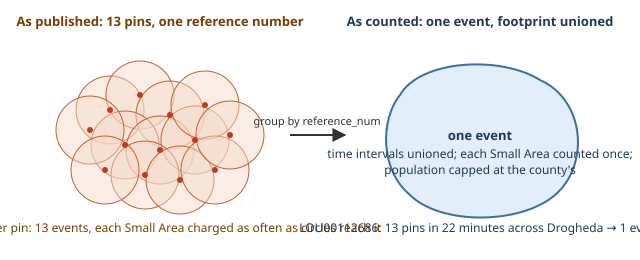
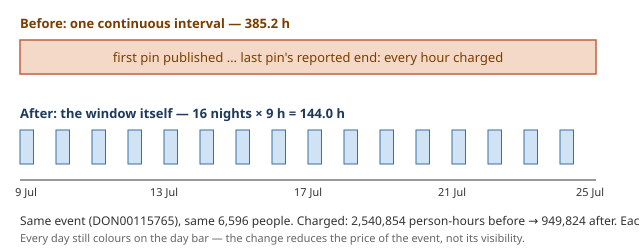

# 9a. Eighteen nights in a trench coat
*~10 min read · PRs #26–#27 · 31 July – 2 August 2026*

*Where we are:* every county has a page that breaks it into named areas, and Leixlip's July is a
row on it (chapter 8b). The next thing to break was not geography. It was the meaning of the
word "disruption" — and it broke because, for the first time, the site listed the *biggest*
ones, and the biggest one was wrong.

## The question that opened this stretch

Person-hours had been computed per county and per area, never per disruption. Ask "what
actually happened in July?" and the site returned 26 county rows rather than the burst that
caused them. So PR #27 added a national top ten — the ten largest events of each complete month
— and the very first ranking put a Donegal *Reservoir Interruption* at number one with
**2,540,854 person-hours**: 9.9% of the whole country's July on its own. The notice said the
water would be off *"daily from 10pm until 7am, from 9 July to 27 July"*. The site had charged
it as one continuous outage of 385.2 hours.

(A small PR came first, and belongs to chapter 7's story rather than this one: on 31 July a
second daily build was added at 12:45 UTC. Notices publish in office hours, so a single
evening build left a mean 7.7 h between a notice going up and it reaching the site; a midday
build halves that to 3.9 h, an overnight one would have bought 0.9 h, a third build 0.4 h. It
was framed, deliberately, as a freshness change and *not* a data-quality one — the 75.7-hour
closure lag from chapter 7 was already written down as the reason shrinking the gap further
buys nothing.)

## What changed

### First, what an event is

Chapter 5a introduced the grouping and chapter 8b used it; this is where it has to be exact.

> **Concept: pin, case, event.** The utility publishes one *notice*, and puts it on the map as
> one or more *pins* — one per affected place. Each pin is a row in the feed and a *case* in the
> database. All pins sharing a `reference_num` are one *event*. `LOU00112686` is 13 pins across
> Drogheda, created within 22 minutes, identical title and text; nationally 675 reference
> numbers cover 1,930 rows, so 6,758 "cases" were about 5,485 events. Everything the site adds
> up is added up per event: the pins' **time intervals are unioned** (an hour covered by three
> pins is one hour), the pins' **footprints are unioned** (a Small Area reached by three pins is
> counted once), and the unioned population is **capped at the county's**. Counting per pin
> would charge a 13-pin burst thirteen times over, mostly for the same people.

### The top ten, and a leak it exposed

Complete months only — the in-progress month reshuffles between builds as open events accrue.
Person-hours clipped to the month, so the ranking sums against the county figures already
published. And the ten largest events were **21.9% of July's national person-hours** — the
distribution is that skewed, which is why the page earned its place.

Building it turned up a bug that had nothing to do with recurrence. Chapter 4's title rules
give a case `work_category = NULL` when no rule matches the title — and NULL had been sitting in
the set of "unplanned repair" categories that classify as *outage*. So every spelling the rule
table missed was silently a hard supply outage, accruing person-hours. Sixty-six cases were
unmatched; the largest group was 19 restriction notices spelled `Water Conservation/Restriction`
against the rule's plural, and one of them ranked **#9 nationally** while being, correctly
categorised, a *degraded* event that accrues nothing. NULL no longer defaults to an outage, and
every backfill now prints the title prefixes it could not place — which, on its first run, found a
*Lifting of Do Not Consume Notice* stored as `consumption_notice_issued`, the opposite claim,
knocking a grade off Cork.

### The representation was the bug, not the reading

Back to Donegal. The instinct was that the model had misread the notice. It had not: prompt v2
already recognised recurring windows and reported the *last date at the closing time* — 7 am on
27 July — exactly as instructed. The loss was in what the site could *store*: one end instant.
"From 9 July at 22:00 to 27 July at 07:00" is a single interval of 385 hours; nothing in a
start and an end can say *only nine of every twenty-four*.

> **Concept: recurring windows cover hours, not days.** *"Daily from 10pm until 7am, from 9 to
> 27 July"* is a schedule: eighteen nights of nine hours, 162 hours in all — not sixteen days,
> not 385 hours. Charging it continuously over-counts by a factor of 24 ÷ 9 ≈ 2.7. To charge it
> correctly the site needs the *window* — open time, close time, first date, last date — and
> has to expand it into a list of intervals, one per night, before any accounting. So prompt v3
> asks the model to report the window as well as the end (in the same fields, so the earlier
> answers stay comparable), and a case now carries a *list* of intervals rather than one. The
> union, clipping, month and day-bar code already handled lists; only the event grouping had to
> change.

Validation cost no new labelling. Because `local_date` and `local_time` kept their v2 meaning,
the replay harness from chapter 5b re-scored v3 against both existing rounds: **identical to
v2** — 99/114 on round 1, 120/120 on the unseen round, zero parse errors across 234 rows. And
round 1 turned out to contain the only labelled recurring cases, eight of them, all of which
v1 had got wrong and v3 holds.

| | before | after |
|---|---|---|
| National July person-hours | 27,505,846 | **25,395,359** (−7.7%) |
| Donegal July | 3,700,792 · 97.023% | **2,118,941 · 98.295%** |
| Donegal per-capita | 22,156 h per 1,000 | **12,682** |
| July's largest event | 2,540,854 @ 385.2 h | **949,824 @ 144.0 h** |

The per-capita row is the one that matters. The methodology promises readers that letter grades
are assumption-dependent but *county ordering is real*, and Donegal had sat at double the field
on the strength of one notice's missing field. Its day bar still shows all 31 July days — the fix
reduces the price of the event, not its visibility.

### Two things that went wrong, and what they taught

**The first v3 run barely moved anything** — national July fell 0.4% against a projected 5.9%.
The reason is a good example of how an event's pins interact. Seventeen of the Donegal event's
eighteen pins carried the notice with the schedule; the eighteenth was the *completion update*
— "works are now complete" — which, reasonably, reported no forward window. But an event's
intervals are unioned, and that one pin's continuous interval, from its publication to its
completion, re-covered every gap its seventeen siblings had carved out. Seventeen expanded
correctly; one un-expanded pin put the 385 hours back. So a window became a property of the
*works*, not the pin: `event_windows` lends any window an event's pins reported to the pins that
reported none, clipped to the borrowing pin's own start and end.

**The report built to catch exactly that failed to fire.** It grouped only pins that had
*claimed* a window — so the pin doing the damage, which claimed nothing and looked like any burst
main, never entered the check. Found by verifying the flagship's numbers by hand rather than
trusting a clean-looking report, and fixed with a test for that pin. Three guards now print on
every build: a close-time cross-check against the eight labelled rows; a check that every window
value the model reported is *quotable* from the description it read (89 of 97 exact, 0 flagged
— no invented windows); and a per-build recurrence report that includes the pins that claimed
nothing.

### Worked example: DON00115765

The event: 18 pins across Lifford and Rossgier, published 9–11 July, one Reservoir Interruption
notice, *"daily from 10pm until 7am, from 9 July to 27 July"*, and a completion update after
sixteen nights.

- **Announced schedule:** 18 nights × 9 h = 162 h.
- **Actually run:** the completion pin ended it after 16 nights → 16 × 9 h = **144.0 h**.
- **Charged before v3:** the union of the pins' start-to-end intervals, 9 July to the
  completion — **385.2 h**, i.e. 24 hours a day for sixteen days.
- **Footprint:** the union of 18 pins' Small Areas, **6,596 people** (949,824 ÷ 144.0).
- **Person-hours:** 6,596 × 385.2 = 2,540,854 before; 6,596 × 144.0 = **949,824** after.

Chapter 5a's Drogheda interruption — 23.8 h, one continuous block, no schedule — is the
control: it is untouched by any of this and stays at 551,427 person-hours, which is exactly the
discrimination the change exists to make.

## Where it left the site

A top-ten page, a NULL that no longer means "outage", and a model reading windows as well as
ends — with the July national total 7.7% lower and Donegal off the top of the per-capita
table. Three things were left on the list: recall of windows the model missed entirely was
unmeasured (a labelled round worth doing: 56 notices, ~9 outage-class); the open list and the
top ten still *named* an event by different rules (4.7% of events); and — the one that mattered
— 949,824 person-hours for 6,596 people still looked like a lot for water that was off nine
hours a night. It was. That is chapter 9b.

## Notes

- PR #26 (31 Jul 2026): 12:45 UTC build; simulated over 8,135 cases: 1× 18:45 mean 7.7 h /
  p90 11.1 h; 2× 06:45+18:45 6.8 h; 2× 12:45+18:45 **3.9 h** / 5.6 h; 3× 3.5 h; burst mains
  8.7 → 4.0 h; cron `20 11` because runs land ~1 h 20 after; concurrency group.
- PR #27 (2 Aug): `#top`, ten largest = 21.9% of July, one 9.9%; NULL in `REPAIR_CATS`, 66
  unmatched, 19 `Water Conservation/Restriction`, one #9; Cork DNC lift stored as issued;
  prompt v3 windows, `resolve_case` expands, `Region.add` only change; replay 99/114 and 120/120,
  0 parse errors / 234; 8 labelled recurring rows; results table above; first run −0.4% vs
  −5.9%; `event_windows` lends; report grouped only claimants; `unquotable_windows` 89/97
  exact; 29 cases hit context length, prompt 6,255 → 9,746 chars; recall pool 56 (~9 outage).
- `notes/statuspage-methodology.md` "The national top ten", "Recurring windows cover hours,
  not days"; `notes/data-quality.md` "Multi-pin events" (LOU00112686; 675 refs / 1,930 rows;
  6,758 ≈ 5,485), "A missing variant was silently inventing supply outages".
- 144.0 h = 16 nights × 9 h and 6,596 = 949,824 ÷ 144.0 are my reconciliation of PR #27's
  figures with PR #29's "6,596 people"; DON00115765 pin count 18, publication 9–11 Jul, verified
  18 Aug 2026 against `out/uisce.db`.
