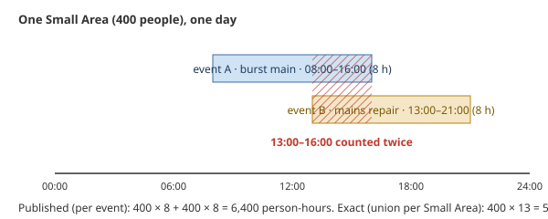
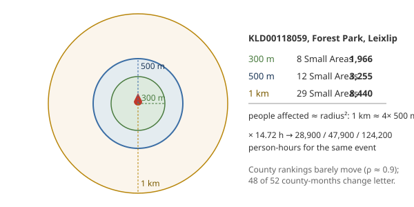

# 12. Put a number on what you don't know
*~12 min read · PRs #40–#41 · 15–18 August 2026 (with a probe from 16 July)*

*Where we are:* the site is correct in the ways chapters 5–9 made it, readable (chapter 10), and
findable (chapter 11). This last stretch of work — so far — is about the numbers the site had
been quietly *not* putting on the page: an event with no usable end, charged as zero; a
double-count nobody had sized; and two assumptions, the 500 m radius and the grade thresholds,
that had been carried since chapter 5a without being examined in public. It ends with three
strangers reading the whole thing cold.

## The question that opened this stretch

Not every case the utility opens is properly closed. Chapter 6 kept those events out of the
published median, correctly, and — for a different reason — gave them a token one-second
footprint in the availability arithmetic. On 15 August the question was asked directly: **what
does an event with no usable end actually cost the county?** And the answer the site was giving
was *nothing*.

## What changed

### PR #40: a total has no NULL

> **Concept: imputation versus exclusion — a median can abstain, a total cannot.** A median is
> the middle of a list; leave an event out and the list is shorter, but honest. Availability is
> a *total* — person-hours lost, divided by a denominator fixed by population and calendar. Leave
> an event out of a total and you have not abstained: you have entered **zero**. "Exclude" and
> "impute 0" are the same operation, and there is no third option. One second is not a
> conservative reading of a burst main; it is a claim that it disrupted nobody. So the two
> figures diverge, deliberately: the median keeps excluding events with no observed end, and
> availability *charges* them an estimate — with the estimate counted and shown on the page.

The population turned out not to be what its name suggested. Of 4,473 outage-class events, 204
had taken the token footprint — but only **4** were genuinely `not_found`, no end anywhere in the
text. **200** were chapter 6's negative-span family: the end is *known*; it is the publication
timestamp that is broken, because the feed re-stamps it in place. A further 29 were open with no
signal at all — true right-censoring, handled by the accrue-to-now branch. So this was
overwhelmingly "closed, with a known end and a broken start", not "never closed".

What is charged: the **median observed-completion span for the event's `work_category`** —
`mains_repair` 7.5 h, `pump_repair` 43.7 h — drawn from observed completions only (the same
tier the headline rests on), requiring at least 15 observed cases before a category speaks for
itself, capped at 14 days. The negative-span family is anchored **backwards** from the end it
does know, so the hours land on the days the works ran rather than the day the notice finally
went up. And if there were no observed completions at all, there would be no table and the
token would stand — a guess with nothing behind it is worse than the zero it replaces.

Why the median *still* excludes them, in order of weight: the project had already drawn this
line — 894 scheduled ends are excluded from the headline because a plan is not an observation,
and an imputed category median is *weaker* evidence than a published plan; complete-case
analysis is valid here (below); and it barely moves — pooling all 204 in gives 12.9 h against
13.4 h, *downwards*, because 102 of them are mains repairs.

> **Concept: censoring, and the check that would have made exclusion dishonest.** Leaving events
> out of a median is only honest if the ones left out are not systematically different from the
> ones kept. Two checks. First, a *Kaplan–Meier* estimate — the survival-analysis technique for
> "how long do things last when some of them haven't ended yet" — treating the 29 open,
> no-signal events as censored (they lasted *at least* this long) gives a median of **13.9 h**
> against the naive **13.4 h**: nearly the same, so the open ones are not hiding a population of
> long outages. Second, for no-signal cases that carry a `closed_at`, calibrating that against
> observed completions implies **~10.7 h** for the missing group against 16.9 h for the observed.
> The missing events are *shorter*, not longer. Had either check gone the other way, excluding
> them from the median would have been the dishonest choice.

Measured by building the site both ways over the same rows:

| | Apr | May | Jun | Jul | Aug |
|---|---|---|---|---|---|
| median notice→completion (h) | 7.1 → 7.1 | 12.6 → 12.6 | 15.8 → 15.8 | 12.5 → **12.7** | 15.2 → 15.2 |
| events imputed | 23 | 39 | 53 | 58 | 43 |
| person-hours | +2.9% | +3.4% | +2.4% | +2.3% | +4.4% |
| national availability | −0.012 pp | −0.015 pp | −0.013 pp | −0.014 pp | −0.020 pp |

Four county-months drop one grade (Limerick April B→C, Mayo May C→D, Monaghan and Offaly August).
July's median moved 0.2 h, and the PR calls it what it is — a real leak: five events of 4,473
carry an observed completion on one pin and an estimate on another, and their unioned spans grew.
The regulated analogue, Ofwat's supply-interruptions commitment, is the same shape (a total of
property-minutes) and takes the same position — "there are no exclusions"; missing timestamps
are *modelled* — and requires reporting what proportion of times came from each source, which is
what the page's "N estimated" count now is. One deviation is written down as a limitation: Ofwat
resolves uncertainty toward the *highest* interruption value; a category median is a central
estimate, and so favours the utility.

Three things came in alongside. `cases.first_start_date` (schema v3) stamps the publication time
seen on the *first download* and never advances it — using "keep the first" rather than "keep the
minimum", because a backward re-stamp is as real as a forward one and chapter 6 rejected the
minimum rule. The `cases` schema became declared exactly once, after adding one column broke ten
tests because the table was written out by hand in three places and two were missed. And
`CLAUDE.md`, a settled-decisions index for the repository, exists because the first draft of this
very change re-proposed a rule that had been measured and rejected four weeks earlier — the notes
were 33,000 tokens across ten files and nothing loaded automatically.

### PR #41: three strangers, and a number where there wasn't one

On 18 August three external reviews — code, usability, methodology — were triaged against the
notes and applied where they held up. Every claim was re-measured before it was trusted, and a
few did not survive that.

*Contrast.* Three of five grade chips failed the accessibility threshold for white lettering (A
3.35:1, B 2.87:1, D 2.64:1); a "partial" badge was **1.79:1**, yellow on off-white; the boil-water
mark — the most safety-relevant element on the page — 2.64:1. Fixed with separate text colours,
fills untouched. The reviewer also said the month tabs already overflowed a 390 px phone at five
tabs; measured, they don't — they start to at *six*, by 42 px, which would arrive on 1 September.
Shipped ahead of the fault.

*The health flags are not signals.* Traced from a single reader-level oddity — Donegal carried a
health marker for May, and the notice behind it was titled *Low Pressure* and never mentioned
drinking water. Measured across the corpus: the feed's `boil_water_notice` flag is 100% reliable
and 100% redundant with the title category; its `do_not_drink` flag is **wrong on 9 of 19**
cases. Because the classifier tested those flags ahead of the hard categories, five burst mains
and mains repairs had been classed as *quality* and accruing nothing. Both flags dropped; category
only. Eight county-months changed, no grade moved, national person-hours +0.09%, and nine false
health markers vanished. The alternative — text-gating the flags — was byte-identical on every
case on file, so it was rejected as a regex that could only rot.

*Do-not-consume notices got half the boil-notice policy.* The pairing (issue → lift, chapter 5b),
yes. The staleness exclusion, no: that rule rests on a boil notice that sat Open while its own
text said it was lifted, and no do-not-consume notice on file does that — Whiddy Island, Open
since 2022, names a real, unlifted failure. Dropping a stale boil notice that was in fact lifted
costs nothing; dropping a live do-not-consume removes a drinking-water warning. And a paired lift
is now capped at 14 days for what it *charges* but uncapped for the health *marker*, so a notice
the lift proves was standing still shows in the months it stood.

*The overlap.* The last limitation in the methodology carrying no number.

> **Concept: overlap double-counting.** Two outages that reach the same Small Area at the same
> time each charge its full population for their full duration — so for the hours they overlap,
> those people are counted twice. Nationally the effect is bounded by how often events overlap
> in both place and time. The probe re-unions intervals *per Small Area across events*, which
> cannot double-count by construction, and reports the gap between that and the published
> per-event total.

The first run said **3.6%** — and it was wrong in two ways, both found in review the same day.
It de-overlapped per *pin* while the published side accrues per *event*, so an event's own
staggered pins (July's 18-pin Donegal event, again) read as double-counting — a two-pin event
with no overlap at all reported 50%. And it resolved cases without the new span table, so every
no-signal event took the one-second token instead of the imputed span, and the probe's "published"
total came out at 77.2M against the site's actual 79.8M. Corrected, the figure is **2.0%** —
1.58M of 80.3M person-hours over April to August, 0.5–2.5% by month — and it is left uncorrected
on the page, deliberately: it is pessimistic (overstates disruption), it is smaller than the error
already conceded by the radius assumption, and correcting it would reach into the availability
arithmetic itself. The lesson written down for the next probe: reproducing a published number
means reproducing the *whole* path that produced it, and a diagnostic that cannot reproduce the
total it claims to be a fraction of is measuring something else.

### The two assumptions, examined in public

Two things had been carried since chapter 5a without being put on the page. Both belong here,
because this is the chapter about what the site does not know.

**The radius.** On 16 July, May and June were rebuilt at 300 m, 500 m and 1 km. County *rankings*
by availability barely moved (rank correlation against the 500 m baseline 0.93/0.91 at 300 m,
0.90/0.86 at 1 km). *Grades* did: **48 of 52 county-months change letter** somewhere across the
range, because affected population scales roughly with radius², shifting everyone against fixed
thresholds together.

> **Concept: the grades are letters about an assumption.** Read the A–F as calibrated to the
> 500 m assumption; read the *ordering* of counties as real. A percentile-based grade would be
> radius-invariant, at the cost of losing fixed meaning across months, and fixed meaning across
> months is what the letters are for.

**The thresholds.** Chapter 5a stated them and promised the story. They were fitted to the
distribution of the site's own settled county-months — 78 of them by August: p10 ≈ 98.9%, median
≈ 99.6%, p90 ≈ 99.87% — so that A ≥ 99.9 sits at about the 97th percentile, B ≥ 99.75 the 76th,
C ≥ 99.45 the 33rd, D ≥ 99.0 the 10th. Not a regulator's numbers, for the reasons chapter 5a
gave. And when four definitional changes in two days (chapters 9a–9b) took national July
person-hours down 11.8%, the cuts were checked and *not* moved: every one sat at the percentile it
always had, and exactly one county-month changed letter. Fixed thresholds are what make a month
comparable with the month before; the price is that they are letters about a 500 m circle.

### Worked example: three unknowns, priced

*An event with no end.* A mains repair, closed, whose text gives a completion time but whose
publication stamp is *after* it — chapter 6's family. Before 15 August: charged one second,
i.e. nothing. Now: charged the mains-repair median, **7.5 h**, anchored back from the known end,
times its footprint. Its span still does not enter the median.

*The same event under a different radius.* The Leixlip pin from chapter 8a, 14.72 h: 1,966 people
at 300 m ≈ 28,900 person-hours; 3,255 at 500 m ≈ 47,900; 8,440 at 1 km ≈ 124,200. Same water,
same street; a factor of four between the two ends. That is what "the letters are about an
assumption" means in numbers.

*Two events over one Small Area.* 400 people; a burst main 08:00–16:00 and a mains repair
13:00–21:00. Published: 400 × 8 + 400 × 8 = 6,400 person-hours. Exact: 400 × 13 = 5,200. The
three overlapping hours are the 1,200 difference — 23% here, 2.0% across the country.

## Where it left the site

Every event now costs something, and the page says how many were estimated. The double-count has
a number. The radius and the thresholds have their caveats where a reader will meet them. Nine
health markers that should never have shown are gone, and the grade chips can be read. Three
things a stranger noticed were true; several things a stranger proposed were measured and
declined, with the numbers written beside the refusal. That is where the repository stands on
18 August 2026 — and where this account stops.

## Notes

- PR #40 (15 Aug 2026): 204 of 4,473 (200 negative-span, 4 `not_found`, 29 open censored);
  `SpanTable` (median observed span per `work_category`, `MIN_CATEGORY_N` 15, `CAP_DAYS`);
  `mains_repair` 7.5 h, `pump_repair` 43.7 h; 102 of 204 mains repairs; KM 13.9 vs 13.4 h;
  `closed_at` calibration ~10.7 vs 16.9 h (start→closed_at 80.8 h vs 70.1 h overshoot); pooled
  12.9 vs 13.4; effect table; four county-months; Offaly Aug −0.179 pp; 5 events leak 0.2 h;
  Ofwat "no exclusions" / "verified modelled data"; `first_start_date` COALESCE; `CASE_COLUMNS`,
  ten tests; `CLAUDE.md`; 354 tests.
- PR #41 (18 Aug): WCAG 3.35/2.87/2.64/1.79/2.64:1; month tabs overflow at six by 42 px (1
  Sep); `do_not_drink` wrong 9 of 19, `boil_water_notice` redundant; 8 county-months, 0 grades,
  +0.09%, 9 markers; DNC pairing not exclusion (Whiddy Island); paired lift capped for charge,
  uncapped for marker; overlap 3.6% → 2.0% (1.58M of 80.3M; 0.5–2.5%/month; first run 2.77M of
  77.2M, 3.0–5.1%); three doc drifts; 367 tests.
- `notes/statuspage-methodology.md` "An event with no usable end is charged a typical span",
  "Known limitations", "Radius sensitivity (checked 2026-07-16)" (0.93/0.91, 0.90/0.86; 48 of
  52), grade calibration (78 county-months; p10/median/p90 98.9/99.6/99.87; 97/76/33/10th pct);
  `notes/data-quality.md` "The two health flags are not signals either".
- Leixlip radii from chapter 8a (measured 18 Aug 2026); person-hour products are my arithmetic.
  The overlap toy is illustrative.
