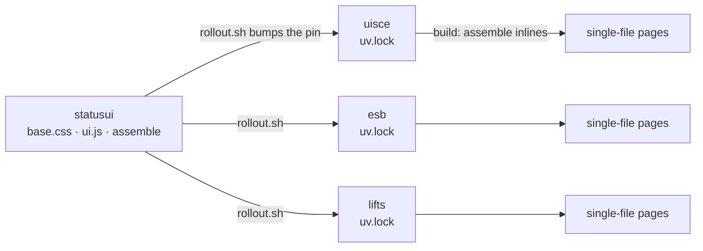

# 14. One design, three sites
*~12 min read · PRs #42, #44–#49 · 19–21 August 2026*

*Where we are:* chapter 12 left the repository at pull request #41 on 18 August, with the
arithmetic settled and two cold reviews answered. The three days that followed changed two
things that are not arithmetic: how the pages look and are built (this chapter), and how the
end times are read (chapter 15). Neither moves a published number; both change what it costs
to keep the site honest.

## The question that opened this stretch

By August there were three of these sites, not one. The water site you have been reading about
has two siblings — one for electricity outages (`esb`) and one for lift faults (`lifts`) — built
the same way, from a feed into an archive into a static page, and deliberately made to look
alike: the same county rows, the same bars, the same grade chips, the same footer. A reader who
has learned one should be able to read the others.

The cost of that likeness was that every UI fix was being made three times, by hand, and not
always. The contrast pass in chapter 12 — the grade chips that could not carry white text —
landed here on 18 August and never reached the electricity site. Each repository carried its own
copy of the same few hundred lines of CSS and JavaScript, "kept in step by hand", which is a
phrase that describes a wish rather than a mechanism.

There was also a smaller, more immediate complaint, from my own phone: the county list had no
way to tell you what a day meant.

## What changed

### A readout instead of a tooltip (PR #44, 19 August)

Each county's row is a bar of tiny day cells — about eight pixels wide each — coloured by that
day's worst severity. On the county page, the big bar already had a caption strip under it that
filled with that day's status — the date, the worst severity, how many people — the moment the
pointer reached a cell.
The overview list had nothing of the kind: each cell carried its caption only as a browser
tooltip (`title=`), which appears after a delay and never on a phone.

The fix was to give every list row the same caption strip, filled instantly on hover, and to
delete the tooltips — they now duplicated the readout, more slowly. The strip sits *inside* the
row's grid rather than beside it, so the row's hover band, click target and keyboard-focus ring
cover it by construction; the sibling sites had placed it beside the row, and their hover grey
stopped a line above the text.

On a phone the strip was hidden: a tap on a cell navigates to the county anyway, and an
eight-pixel cell is far below any usable touch target, so there was nothing for it to show. I
gated that on *hover capability* rather than screen width, so a narrowed desktop window with a
mouse keeps its readout. Within the day a review found the first hole in that: an iPad reports
"no hover" even with a trackpad attached, yet hovers fire there — so the gate had taken the
caption away from exactly the pointer that could use it. The strip is now hidden only while it
is empty; a trackpad hover fills and reveals it. That exception comes back, the other way round,
in the phone review below.

### The design layer moves upstream (PR #45, 19 August)

The same day, the shared part of the page — the colour tokens for light and dark, the base
rules, the row/bar/card components and the small browser helpers — became one set of files in a
fourth repository, `statusui`, and this site took its copy from there.

> **Concept: a page assembled at build, not fetched at load.** A normal website links to a
> stylesheet and a script, and the browser fetches each one after the page arrives. These sites
> do not: every page is a single file with its CSS and JavaScript written into it, so a reader
> arriving from a search result costs exactly one request, and nothing breaks if a second file
> is slow or missing. Sharing a design layer across three such sites therefore cannot mean
> "link to the same stylesheet". It means that at *build* time — when the Python program writes
> the pages — a function (`statusui.assemble()`) inlines the shared CSS and JS into each page at
> two markers, and the site's own styles follow and override. The reader's browser sees one
> file, as before; the difference is where the build got the text from.

What is shared and what is not was written down as a rule rather than a list: a rule goes
upstream when at least two sites want it and none wants it different, and becomes a custom
property (a named knob the site can set) the moment one does. So the tokens, the reset, the
banner, the month tabs, the overview row, the grade chip, the bar and caption, the footer and
the 640-pixel phone reflow are shared; the bar *colours* (each site maps its own cell values to
hues), the two layout knobs for the row columns, and every domain widget — the health marker,
the towns table, the top ten — stay here. The three page templates stopped repeating a
`:root` block each; a 23-line `site.css` carries what every page of *this* site shares and
nothing else.

The visible cost of unification was small and is worth listing because it was paid knowingly:
month tabs abbreviate to "Aug 2026" like the siblings (the strip was already wrapping on a
phone), the county page's grade chip took the shared 32-pixel size, and the footer disclosures
took the shared arrow. In return the siblings picked up this site's contrast-checked tokens.
Three helper names collided and were renamed on this side; one test now parses the *assembled*
page, since the template alone no longer carries the rules it guards.

> **Concept: vendor or pin.** There are two ways for a project to use code kept somewhere else.
> *Vendoring* copies the files in: the project is self-contained, every change shows as a real
> diff in its own pull request, and nothing has to be installed — but the copy is only as current
> as the last time someone ran the copying script, and nothing tells you when it is stale.
> *Pinning a dependency* records a pointer instead: "use `statusui` at commit `61b642c`", written
> into a lock file that the build reads. The files are fetched at build time from that exact
> commit, so what the build used is recorded, visible in the repository, and identical on every
> machine; moving to a newer version is a one-line change to the pointer. I chose vendoring
> first, for the self-containment, and reversed it the next day (below).

### A phone in the hand (PR #47, 19–20 August)

With the layer shared, I sat down with the index page on a 390-pixel iPhone and went through it
as an owner rather than a developer. The findings split cleanly into the shared layer and this
site, which is the first time that distinction had paid for itself.

**Shared.** The month tabs wrapped: at five months the strip was already two rows on a phone,
and a simulated twelve months measured three to four rows sitting above the county list. The
strip became a single horizontally scrolling row — hidden scrollbar, edge shadows only where more
tabs lie — and a function that scrolls the selected tab back into view after each render.

#### Worked example: the month strip

At twelve simulated months the tabs measure 1,095 pixels laid end to end; the strip they sit in
is 356 pixels wide on that phone. Wrapped, that is ⌈1,095 ÷ 356⌉ = 4 rows of pills before the
first county. Scrolling, it is one row with about two-thirds of it off-screen to one side, and
the page's own scroll width stays exactly the viewport — the page does not scroll sideways, only
the strip does (measured 19 Aug 2026, PR #47). The alternatives were a "recent + older" split —
two controls where readers overwhelmingly want the current month — and a drop-down, which loses
one-tap adjacency between neighbouring months.

Then a finding against the finding: the reveal ran only on render, and nothing re-renders on a
rotate. At 851 pixels wide the strip fits, with "Aug 2026" at x = 352–439 and the scroll
position at 0; turn the phone to 375 pixels and that is a 341-pixel strip still scrolled to 0,
with the selected tab entirely out of view while the page below shows August. One resize
listener now re-reveals the tab in every laid-out strip.

> **Concept: hover is not touch.** A page can ask the browser "does this device hover?" and
> "is the pointer coarse?", and style itself accordingly — that is how the list caption was
> hidden on phones. But the answers describe the *device's default*, not the pointer in use. An
> iPad with a trackpad answers "no hover" and then hovers. And iOS fires a *hover* event
> (`pointerover`) on the touch that starts a tap or a scroll. So the caption strip hidden "while
> empty" was being filled by the first touch, un-hiding itself and growing the row by 17 pixels —
> exactly what the gate existed to prevent. The fix reads the pointer *type* on each event and
> ignores hovers whose type is `touch`; a trackpad reports `mouse` and still works. The general
> lesson: gate on the event you actually received, not on what the device says it usually does.

**Shared, continued.** Under 640 pixels the overview is a single column, and the desktop margins
that had politely overlapped on a wide screen stopped doing so, leaving the section gaps wherever
they fell: measured down the page, 22 / 6 / 14 / 14 / 18 / 30 / 16 pixels — the 6 being this
site's health-key margin, tuned to sit under the legend on desktop, applying after the phone
reorder had moved it under the controls. The column now zeroes its children's vertical margins
and spaces them itself: 24 / 12 / 12 / 24 / 24 / 24 / 12 / 12 after (PR #47, notes
"The iPhone review pass 2026-08-19").

**This site.** Copy cut to what a phone can carry: the subtitle went from four lines to two
("Uisce Éireann water outages, restrictions and works. Pick your county for details."); "Partial
month — in progress" became "Month in progress."; the "What this measures" block went behind a
footer disclosure like its two siblings; the top-ten view's month tabs got the same pill as the
other views.

## What went wrong, and was reverted

One copy change was wrong against the data, and the archive caught it. The always-visible
health key had been shortened to "boil-water or do-not-drink", on the argument that
*do-not-consume* folds into *do-not-drink* for a lay reader. Then I counted. Of the 42 notices
in the archive that raise the health marker, 35 are boil-water notices and 7 are consumption
notices — every one of the 7 titled "Do Not Consume Notice" — and **no notice in the feed has
ever contained the word "drink"** (measured 20 Aug 2026, PR #47). The short line named a kind
the site has never published and dropped the only other kind it marks, on the marker's one
always-visible explanation, while the pill, its tooltip, the methodology and the area badge all
still named three. Reverted; the key names all three kinds. Folding for a lay reader is fine
where the fold is true; here the generic term was the one that does not occur. (Chapter 12's
finding that the feed's `do_not_drink` flag was wrong on 9 of 19 is the same fact from the other
side.)

### One day of vendoring was enough (PR #48, 20 August)

The vendored copy lasted a day. A shared fix meant a sync, a test run, a commit and a pull
request in each of three repositories — and the sites drifted anyway. When I measured, the
electricity and lift sites were synced to `statusui` commit `f248ac3` while this site's main sat
at `c9f8beb`, **five UI commits behind**, with nothing failing to say so: the byte-compare test
that guarded drift only fires against the checkout you happen to have beside the repository,
and skips otherwise. The catch-up sync eventually arrived buried in the phone-review PR above.

So `statusui` became an installable package, and this site now declares it as a git dependency
pinned to a commit in `uv.lock`. The vendored tree, the sync script and the byte-compare went.
What remains is one guard — that no page script redeclares a shared JavaScript global — reading
the installed package; a one-line way to try an unpushed upstream change here first
(`uv run --with-editable ../statusui uisce-site`); and a `rollout.sh` upstream that bumps the
pin in all three sites, runs each site's tests and opens the three pull requests in one command.
The pages are unchanged: `assemble()` still inlines the shared files at build, so a search-result
landing still costs one request. The pin landed at the commit whose content the last sync already
carried, so the switch itself changed nothing but the shared files' header comments.

### The first real rollout (PR #49, 21 August)

The next morning was the first change made the new way. The banner at the top of the page
carried a coloured status dot beside its sentence; on a phone the dot pushed the sentence onto a
second line, and a colour swatch beside a sentence that already states the numbers adds nothing
the county rows do not. The dot component was dropped upstream in one commit, `rollout.sh`
opened three pull requests, and this site's was +2/−4 lines: the pin bump and the removal of its
own dot markup.

## Where it left the site

On 21 August the shared layer is 241 lines of CSS and 142 of JavaScript in `statusui`, pinned
at `61b642c`; this site's own stylesheet is 23 lines, and the rest of what makes the water site
the water site — the health marker, the towns table, the top ten, the history rows, the copy —
is the ~900 non-blank lines of its page template (measured 21 Aug 2026). Tests stood at 378.
Nothing a reader can see changed by more than a few pixels, a shorter subtitle and a scrolling
strip — which is the point: the look is now one decision made once, and the sibling sites can
no longer quietly fall five commits behind each other.

A footnote closes an open thread from the ledger: PR #42 (19 August) corrected the README,
which still said the schema was at version 2 when chapter 12's `first_start_date` had taken it
to 3, and added the missing paragraph for the new column.

## Notes

- PR #44 (19 Aug 2026): caption strip inside `.row`; `title=` tooltips removed; `(hover: none)`
  gate, then hidden-while-empty after the iPad-trackpad finding (one-time 17 px growth); 374
  tests.
- PR #45 (19 Aug): `statusui` vendored under `src/uisce/ui/`, `assemble()` at `<!--UI-CSS-->` /
  `<!--UI-JS-->`; renames `plural`→`pl`, `monthLabel`→`monthLabelLong`, `dayCells(describe)`;
  `test_site_css.py` parses the assembled page; sister PRs esb#3, lifts#4; 378 tests.
  `notes/frontend-notes.md` "Shared with esb and lifts since 2026-08-19"; statusui's README
  "What is shared and what is not".
- PR #47 (19–20 Aug): month strip 1,095 px in 356 px, twelve months one row, page `scrollWidth`
  = viewport; rotate 851→375 px, tab at x 352–439; gaps 22/6/14/14/18/30/16 → 24/12/12/24/24/
  24/12/12; health key 42 notices = 35 `boil_notice_issued` + 7 `consumption_notice_issued`, no
  "drink"; `pointerType: "touch"` ignored; `bindMonthReveal()`; statusui `0567472`. Notes "The
  iPhone review pass 2026-08-19".
- PR #48 (20 Aug): drift `c9f8beb` vs `f248ac3`, five commits; uv git dependency in
  `[tool.uv.sources]`, pin in `uv.lock`; `tests/test_ui_globals.py`; `rollout.sh`; +77/−616.
  Notes "2026-08-20: the vendored copy became a pinned uv git dependency".
- PR #49 (21 Aug): statusui `61b642c`, +2/−4. PR #42 (19 Aug): README schema 2→3.
- Line counts measured 21 Aug 2026 against `../statusui/src/statusui/` and `src/uisce/`; the
  pin read from `uv.lock`.
