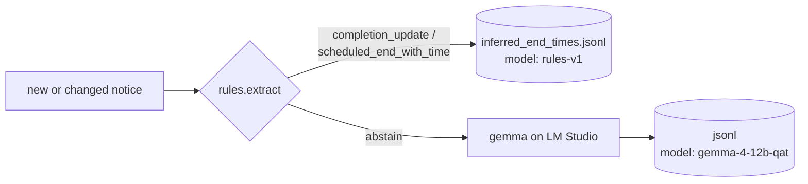
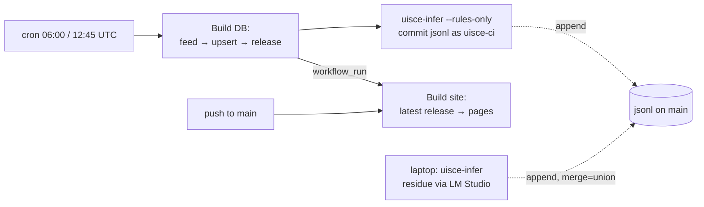

# 15. Rules first, model second
*~13 min read · PRs #46, #50–#52 · 20–21 August 2026*

*Where we are:* since chapter 3 a small language model on my laptop has read the end time out of
every notice, and since chapter 5b it has been measured at 120 of 120 on unseen cases. Chapter 14
moved the site's look into a shared layer. This chapter asks a question that chapter 3's
benchmarks never asked: how much of what the model does is reading at all?

## The question that opened this stretch

The benchmarking detour in chapter 3 tried every way to make the *model* faster — running
requests in parallel, a smaller model, speculative decoding, a different runtime — and closed
them all: decoding is the bottleneck and a full re-read of the corpus costs about eleven hours
of GPU. What it never tried was to ask whether most of the calls needed a model.

Because the notices are not prose. Most of them are a handful of fixed sentences with a time and
a date slotted in — the running example from chapter 1 reads, in full, "**Update 1:00pm
10/08/2026** Works are now complete and supply should have returned to all affected areas. We are
investigating reports of supply disruptions affecting Forest Park, Leixlip…". A human does not
*read* that to find the end; they find the bold header and copy the time out of it. So would a
pattern-matcher. The hypothesis, stated on 21 August: **most of the end-time work is template
filling that a rule can do on a CPU in a fraction of a second, and the model should be kept for
the rest.**

The danger in that sentence is the word "most". A rule that fires on the wrong template does
not hallucinate the way chapter 3's first prompt did; it confidently extracts the wrong number,
every time, for every notice shaped that way. So the question was never "can rules do it?" — it
was "can rules do *part* of it with zero wrong answers, and know which part?"

## What changed

### Acceptance criteria before measurement (PR #50, 21 August)

> **Concept: fix the bar before you measure.** If you build a thing and then decide what
> "good enough" means, you will decide it means whatever you built. Chapter 5b's evaluation
> rounds had the same discipline — the sample and the labelling guide came first, the score
> second — and it is worth naming as a method: write down the thresholds, the comparison
> precision and what counts as a disagreement *before* running anything, then run it once and
> read the table. Here the model's demonstrated floor was 219 of 219 on the site-relevant
> labelled rows of chapter 5b's two rounds, a 95% lower bound of about 98.3%, so the rules were not
> allowed to become the accuracy bottleneck.

The four criteria, fixed on 21 August before the first run, and what was measured (PR #50,
`notes/rules-vs-llm-end-times.md`):

| # | Criterion | Threshold | Measured | |
|---|---|---|---|---|
| 1 | Share of the corpus the rules answer | ≥ 60% | **92.7%** (10,068 of 10,860) | pass |
| 2 | Agreement with the model where the rules answer | ≥ 98%, overall and per class | **99.99%** (10,067 of 10,068) | pass |
| 3 | After reading every disagreement in full | rules wrong ≤ 0.3%, and no more often than the model | rules wrong **0**, model wrong **1** | pass |
| 4 | Human-labelled rounds | 0 wrong emissions | **0** (110/110 and 73/73 on answered rows) | pass |

"Agreement" means the same three fields — end source, local date, local time — to the minute. A
rules answer on a case the model had read as a *repeating* window counts as a disagreement even
when the three fields match, because the rules record would drop the window the site expands
(chapter 9a).

### What rules-v1 is, and what it refuses to be

> **Concept: a rule may abstain but may never guess.** The extractor has exactly one failure
> mode, by design: it returns *nothing* and hands the notice to the model. It will only ever
> answer two of the seven end-time classes from chapter 3 — "works complete" under a dated update
> header, and "until *time* on *date*" (or "estimated completion time of…") in the newest block.
> It never says *not found*: failing to match a template is evidence about the rules, not about
> the notice. It never emits a date without its time, because the site turns such a date into
> 23:59:59 — a silent shift of up to a day. Repeating windows abstain (the window *values* are
> what needed a model, chapter 9a); lift wording, Irish-only completions, unparseable headers,
> invalid dates, two different ends in one block and any "until" the pattern cannot read in full
> all abstain. The residue is the model's by construction, not by accident.

#### Worked example: KLD00118059 through the rules

The Forest Park notice from chapter 1 has the header `**Update 1:00pm 10/08/2026**` followed by
"Works are now complete". The rules find a completion phrase, walk back to the header of the
block it sits in, and read the time and date out of the header: `completion_update`, local date
2026-08-10, local time 13:00 — with a note saying which header it used (run 21 Aug 2026 with
`rules.extract` against `out/uisce.db`). That is the same answer the model gave in chapter 3,
which became 52,987 seconds from the 21:16 publication the night before. The difference is that
the model took several seconds of GPU to say it and the rules took a fraction of a millisecond;
across the whole corpus, 0.6 seconds against about eleven hours.

### Two ways to check, and why both were needed

> **Concept: shadow evaluation, then the truth gate.** There were two ways to test the rules.
> A *shadow* run compares them against the model's existing answer for every case in the
> archive — cheap, corpus-wide, and strong evidence when the model has already been measured at
> ~98%+; it is what produced the 92.7% and 99.99% above (`uv run uisce-eval-rules-shadow`). But
> it tests agreement with an oracle on data the oracle has seen, and the rules' patterns were
> derived by surveying that same corpus, so a sceptic could say the rules had merely learned the
> corpus. The *truth gate* is a human: a fresh sample of notices nobody had looked at, labelled
> by hand, scored for both extractors. The 234 already-labelled rows from earlier chapters could
> not serve, because they were used as the judge during development — a pattern is never tuned
> against its own examiner. So a new round was drawn.

The shadow run before the rules were frozen disagreed with the model on four of 10,075 answered
cases, and every one was read in full:

- **Case 237463 — the model was wrong.** The header reads `**Update 2:42pm 02/07/2026**`; the
  model answered 14:22 — a digit transposition of exactly the kind chapter 5b had measured it as
  never making. It stands as the one residual disagreement, left in place (the no-backfill rule
  below).
- **Case 232976 — garbled at source** ("until 6pm on 9 May until 9pm 13 May"), already on the
  recurrence review's list in chapter 9b; the model reads it as a repeating window, the rules had
  taken the first "until". Now abstains.
- **Case 236066 — "17 June, 18 June and19 June"**: the missing space after "and" defeated the
  day-list guard, so the rules read a single day where the model correctly saw three. Now
  abstains.
- **Case 240600 — "until 5pm on 05 August until 07 August"**: a date range the model reads as
  recurring; the rules took the first end. Now abstains.

Both fixes were strictly *narrowing* — more abstention, no new emissions — which is the only
kind of tuning allowed against observed disagreements without a fresh labelled round. One
iteration, then frozen as `rules-v1`. What the model keeps is a clear taxonomy: of the 792
abstentions, 381 have no template at all ("we are investigating", boil notices), 117 are
completions with an unparseable or missing header, 108 are repeating windows, 91 are lifts, 27
enumerated day lists, 15 Irish-only completions, 12 unreadable "until"s and 41 other — nothing
in it is a class the rules should have answered.

Then the truth gate. 120 unseen cases were drawn uniformly on 21 August and run through the
model, and before any labelling the rules were compared against those fresh answers: coverage
110 of 120 (91.7%), agreement 110 of 110, zero disagreements. Then I labelled all 120 by hand.
The model scored 120 of 120 — prompt v3's second perfect uniform round — and the rules scored
**110 of 110 on every row they answered, 0 wrong emissions at 91.7% coverage**, on cases never
used to derive or tune any pattern. Chapter 5b's rule of three applies again: 110 clean answers
put the rules' true error rate below about 2.7% at 95% confidence on the part they answer — and
the part they do not answer costs nothing, because it goes to the model.

### The hybrid (PR #50, continued)

`uisce-infer` now tries the rules on every case first and opens a connection to the model only
on the first abstention, so a run the rules fully cover never contacts the GPU at all. Each
record in the append-only file from chapter 3 stamps which extractor answered it — `rules-v1`
or `gemma-4-12b-qat` — and the staleness rule from chapter 3 grew one clause: bumping the rules
version re-runs only rules-produced cases; bumping the prompt version still re-runs everything.
Historical model records are **not** backfilled: unchanged descriptions are never re-extracted,
by the same hash-skip rule as always, so the corpus is not re-stamped "rules" overnight. Rules
answer new and changed notices only. The first live run was the morning's four-case backlog —
one templated case answered by the rules, three no-signal cases handed to the model, one stale
record self-correcting to *not found* for changed text (PR #50, 21 Aug).

Four alternatives were rejected and written down: rules for repeating windows too (the values
needed a model, and two of the four disagreements were range forms); rules emitting *not found*
for the "we are investigating" template (turns absence of a match into a claim, and buys
nothing); full replacement with no model (7.3% of the corpus is real language work, and it is
precisely the part with the site's hardest failure modes); and widening the prompt instead
(already rejected for a sibling problem in chapter 6, and v2→v3 had shown prompt widening
doubles runtime).

### The site deploys on its own clock (PR #51, 21 August)

A smaller change sat between the two halves. The site had only ever been deployed by the data
build, so a UI change — and chapter 14 had just made several — waited for the next scheduled
data build, up to six hours. But the site is a pure projection of the published release
database; it can rebuild from that on its own, the way the sibling sites already did. It now
has its own workflow: on every push to main, on demand, and after each successful data build
(which has to hand over explicitly, because a push made by the build's own token fires no
"push" event).

> **Concept: the data clock and the build clock.** The banner says "Updated N hours ago", and
> it exists partly as an alarm: if it ever reads more than 24 hours, the data build has died.
> With UI-only deploys that line would have reset to "just now" every time a colour changed,
> and the alarm would never ring. So the banner now reads the *data* clock — the last moment the
> pipeline read the feed — and only the footer's "Generated" reads the build clock. Two
> timestamps, two questions: how fresh is what you are looking at, and when was this page made?

### CI runs the rules half (PR #52, 21 August)

The point of the hybrid was never the 0.6 seconds. It was this: the model needs my laptop, so
`uisce-infer` had never run in the scheduled build, and every twice-daily build landed notices
with no end signal until I next ran it by hand — a backlog that was almost entirely *open* cases
accruing to "now" in the availability figure. After PR #50 the rules could answer the templated
~93% anywhere, so the build now runs `uisce-infer --rules-only` before it projects the end
times: the rules answer what they cover, count the abstentions and leave them, and never open a
session. After the release is published the build commits the append-only file back to the
repository as a bot user. The never-inferred backlog is now bounded to the abstentions, and
those are the cases whose end is genuinely in the prose.

> **Concept: two writers, one append-only file.** Now there are two processes appending to the
> same file — the scheduled build (rules) and my laptop (the model, for the residue) — and each
> commits to the same repository. Ordinarily two edits to one file collide. Three things make
> this safe. The file is *append-only*, so neither writer changes a line the other wrote. A
> merge rule (`merge=union`) tells git that when both sides have added lines, keep both, in
> either order. And the projection that builds the table from the file keeps the *latest*
> record per case by its timestamp, so the order the union leaves the lines in does not matter.
> The alternative — each writer uploading the whole file as a release asset — was rejected
> because last upload wins and the other's records are silently lost; git at least conflicts
> loudly, and the union rule resolves it.

Where the file should live was the real question. The sibling sites keep collected data in
separate `*-data` repositories, because there a small computer is the writer and its raw logs
are the source of truth. Here the source of truth — the database — is already off-repo as a
release, and the file is a derived cache of it; a data repository would add a checkout to every
workflow and split a freshness guard across two places, for no gain in history or size (about
4 MB of packed repository after 39 commits). It stays.

A footnote: PR #46 (20 August) fixed a dependency-cache setting in the build that had been
misspelled since it was added, so it had never cached anything — the only symptom was a warning
in the logs that nobody read.

## Where it left the site

On the evening of 21 August the append-only file holds 29,756 records over 10,908 cases; 90 of
them are stamped `rules-v1` — 47 scheduled ends, 43 completions — the first written at 08:01 UTC
that morning by the scheduled build, and 89 of them are the current answer for their case
(measured 21 Aug 2026 against `data/inferred_end_times.jsonl` on `main`). The other 29,666
records are the model's, and will stay the model's until the notice text changes. The GPU has
not been retired; it has been put where it earns its keep — the repeating windows, the lifts,
the Irish, the garbled sentence — and a corpus re-run after a future rules change costs seconds
rather than an afternoon. Tests stood at 440.

What the three days did not change is any published number. Leixlip's July is still 438,691
person-hours; the model is still the one that read the eighteen nights in chapter 9a. What
changed is that the site can now keep itself current without me, and look the same as its
siblings without me, which is most of what "maintainable" means for a thing one person runs.

## Notes

- PR #50 (21 Aug 2026): `src/uisce/rules.py` (`RULES_VERSION = "rules-v1"`); acceptance table;
  shadow eval 10,860 hash-stable cases, 92.7% / 99.99% (completion 6,670/6,671, scheduled
  3,397/3,397); four disagreements 237463 / 232976 / 236066 / 240600; abstention taxonomy (792);
  fresh round `end_time_sample_2026-08-21_gemma-4-12b-qat_pv3.csv` (seed 42), 120/120 and 110/110
  at 91.7%; 354 labelled rows across three rounds; first hybrid run 1 + 3 (case 242322 by rules);
  0.6 s vs ~11 GPU-hours; `uisce-eval-rules-shadow`, `uisce-eval-replay --extractor`;
  `RECURRENCE_TEXT` to `config.py`. `notes/rules-vs-llm-end-times.md` whole.
- PR #51 (21 Aug): `.github/workflows/pages.yml` (push / dispatch / `workflow_run`); `Build DB`
  data-only; `data_as_of_iso` = `MAX(cases.last_seen)`; 439 tests.
- PR #52 (21 Aug): `--rules-only`; commit as `uisce-ci` after publish; `.gitattributes`
  `merge=union`; `build.py:latest_per_case` by `inferred_at`; `uisce-data` repo and release asset
  rejected; ~4 MB packed after 39 commits; 440 tests. PR #46 (20 Aug): `enable-cache`.
- KLD00118059 run through `rules.extract` on 21 Aug 2026; JSONL counts measured the same day.
  The 95% bound for 110/110 is the rule of three (3/110 ≈ 2.7%), as in chapter 5b.
